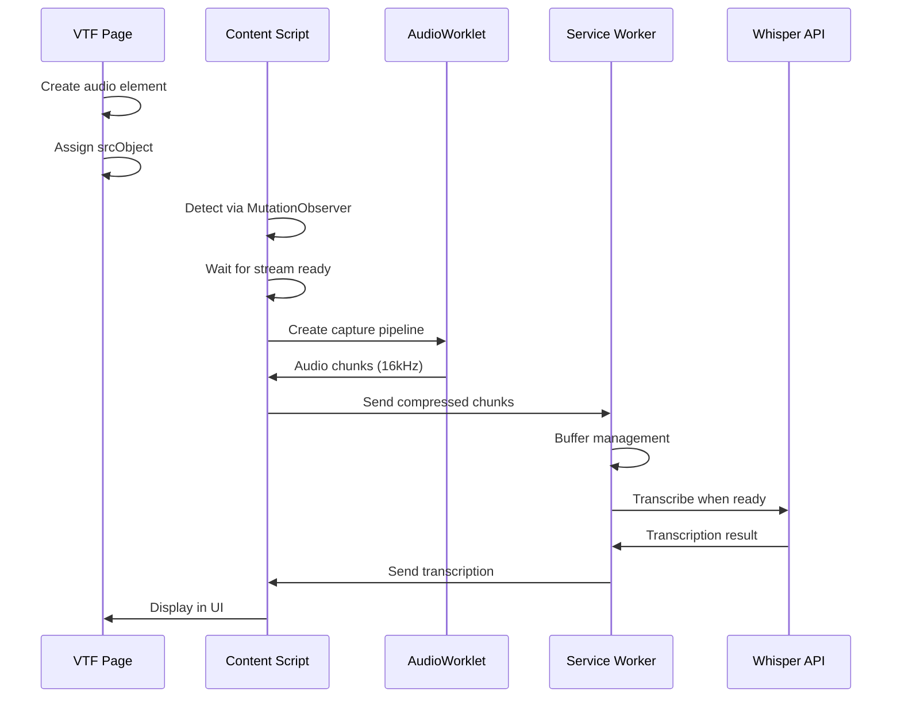
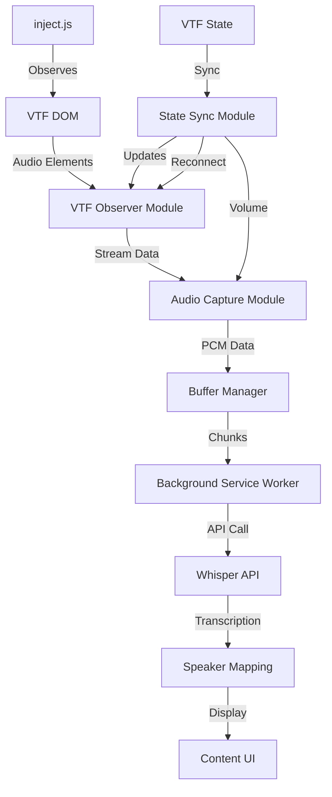

# VTF Audio Extension - Refactor Documentation

## Master Coordinator Prompt

You are the master architect coordinating a systematic refactor of a Chrome extension. Your role is to:
1. Track refactor progress across multiple implementation chats
2. Ensure consistency between modules
3. Manage dependencies and integration points
4. Provide guidance on implementation order

### Project Status Tracking

#### Phase 1: Foundation ⏳
- [ ] vtf-globals-finder.js
- [ ] vtf-stream-monitor.js  
- [ ] vtf-state-monitor.js
- [ ] Test harness setup

#### Phase 2: Audio Pipeline
- [ ] audio-worklet.js
- [ ] vtf-audio-capture.js
- [ ] audio-data-transfer.js
- [ ] ScriptProcessor fallback

#### Phase 3: Core Integration
- [ ] content.js (new)
- [ ] background.js (enhanced)
- [ ] Remove inject.js

#### Phase 4: Testing & Migration
- [ ] Integration tests
- [ ] Migration scripts
- [ ] Documentation

### Your Responsibilities

1. **Dependency Management**: Tell workers what interfaces they must implement
2. **Integration Points**: Define how modules connect
3. **Progress Tracking**: Update checkboxes as modules complete
4. **Consistency Enforcement**: Ensure naming, logging, error handling patterns
5. **Test Coordination**: Verify each module is testable in isolation

### Module Interface Specifications

When a worker asks for requirements, provide:
- Exact class/function signatures needed
- Expected input/output formats
- Error handling requirements
- Logging format: `[ModuleName] message`
- Test requirements

### Integration Guidelines

Each module must:
1. Export a single class or object
2. Have zero direct dependencies on other refactored modules (use events/callbacks)
3. Include comprehensive error handling
4. Provide a `.debug()` method for testing
5. Be testable in isolation

When asked "what should I work on next?", check dependencies and recommend the next logical module.

## Worker Prompt Templates

### Template 1: Foundation Module Worker

#### Implement VTF Foundation Module: [MODULE_NAME]

Implement the [MODULE_NAME] module according to the VTF Audio Extension Design Document v0.5.0.

##### Module: [MODULE_NAME]
File: `src/modules/[filename].js`

##### Requirements from Design Document
[Copy relevant section from design doc]

##### Interface Requirements
This module must export:
```javascript
class [ClassName] {
  constructor() { }
  
  // Required methods:
  [List from design doc]
  
  // Required events:
  [Any events this emits]
}
```

##### Dependencies
- No imports from other refactored modules
- Can use: Chrome APIs, Web APIs
- Must work standalone

##### Implementation Requirements

1. **Error Handling**: 
   - Never throw uncaught errors
   - Return null/false on failure
   - Log all errors with context

2. **Logging Format**:
   ```javascript
   console.log('[ModuleName] Operation successful');
   console.error('[ModuleName] Failed to X:', error);
   ```

3. **Testing Support**:
   - Add `.debug()` method that returns internal state
   - Make timeouts/intervals configurable
   - Provide manual trigger methods for testing

4. **Memory Management**:
   - Clean up all listeners
   - Clear timeouts/intervals
   - Provide `.destroy()` method

##### Deliverables

1. **Main Implementation** (`[filename].js`)
2. **Test File** (`test-[module].js`) with:
   - Standalone test functions
   - Mock VTF environment
   - Success and failure scenarios
3. **Usage Example** showing integration

##### Success Criteria
- Works without other refactored modules
- Handles all error cases gracefully  
- Can be tested via console
- Follows design document exactly

### Template 2: Audio Processing Worker

#### Implement VTF Audio Module: [MODULE_NAME]

Implement audio processing module for VTF Chrome Extension refactor.

##### Module: [MODULE_NAME]
File: `src/modules/[filename].js`

##### Audio Requirements
- Sample Rate: 16000 Hz (Whisper optimal)
- Buffer Size: 4096 samples
- Format: Float32Array (convert to Int16 for transfer)
- Channels: Mono

##### Implementation from Design Document
[Copy relevant section]

##### Special Considerations

1. **AudioWorklet vs ScriptProcessor**:
   - Implement AudioWorklet as primary
   - Provide ScriptProcessor fallback
   - Runtime detection of support

2. **Performance**:
   - Process on audio thread when possible
   - Minimize main thread blocking
   - Efficient buffer management

3. **Browser Compatibility**:
   - Test AudioContext prefix variants
   - Handle suspended context state
   - Graceful degradation

##### Audio-Specific Testing
Include test for:
- Silent audio (should skip)
- Loud audio (clipping)
- Stream disconnection
- Context suspension

##### Deliverable Structure
```javascript
class [ClassName] {
  async initialize() {
    // Set up audio context
    // Detect worklet support
  }
  
  async capture(element, stream, userId) {
    // Main capture logic
  }
  
  stop(userId) {
    // Cleanup
  }
}
```

### Template 3: Integration Worker

#### Integrate VTF Modules: content.js

Create the main content script that integrates all refactored modules.

##### Integration Requirements

###### Modules to Import
```javascript
// Foundation modules (already implemented)
import { VTFGlobalsFinder } from './modules/vtf-globals-finder.js';
import { VTFStreamMonitor } from './modules/vtf-stream-monitor.js';
import { VTFStateMonitor } from './modules/vtf-state-monitor.js';

// Audio modules (already implemented)  
import { VTFAudioCapture } from './modules/vtf-audio-capture.js';
import { AudioDataTransfer } from './modules/audio-data-transfer.js';
```

###### Expected Module Interfaces
[List what each module exports based on previous implementations]

##### Integration Logic

1. **Initialization Sequence**:
   - Wait for DOM ready
   - Initialize VTFGlobalsFinder
   - Set up audio subsystem
   - Start monitoring

2. **Event Coordination**:
   - Module A emits event → Module B responds
   - No direct module coupling
   - Central event bus if needed

3. **Error Boundaries**:
   - Each module failure shouldn't crash others
   - Graceful degradation
   - User notification on critical failure

##### Migration from Legacy
- Map old message types to new
- Preserve storage keys
- Maintain API compatibility

##### Testing the Integration
Provide test scenarios:
1. Cold start (no VTF loaded)
2. Hot reload (VTF already active)
3. Module failure recovery
4. Multi-user audio streams

### Template 4: Test Coordinator Worker

#### Create Integration Tests for VTF Extension

Build comprehensive test suite for refactored modules.

##### Test Requirements

###### Unit Tests Completed
- [ ] vtf-globals-finder.js ✓
- [ ] vtf-stream-monitor.js ✓
- [ ] vtf-audio-capture.js ✓
[List based on actual progress]

###### Integration Tests Needed
1. **Globals + Monitor**: Can they work together?
2. **Monitor + Capture**: Stream handoff working?
3. **Full Pipeline**: Audio element → Transcription

##### Test Environment Setup

Create `test/integration/test-environment.html`:
- Mock VTF DOM structure
- Simulate MediaSoup patterns
- Controllable timing

##### Test Scenarios

###### Scenario 1: Happy Path
```javascript
// 1. VTF globals present
// 2. Audio element added
// 3. Stream assigned
// 4. Capture starts
// 5. Data flows to background
```

###### Scenario 2: Recovery Testing
```javascript
// 1. Start normally
// 2. Simulate reconnectAudio()
// 3. Verify cleanup
// 4. Verify resume
```

###### Scenario 3: Edge Cases
- Globals not found (30s timeout)
- Stream never assigned
- Multiple rapid reconnects
- Memory pressure

##### Deliverables
1. Integration test suite
2. Test runner HTML page
3. Performance benchmarks
4. Test results documentation

## How to Use These Prompts

### Workflow

1. **Start with Master**: 
   ```
   "I'm beginning the VTF extension refactor. What module should I implement first?"
   ```

2. **New Chat per Module**: 
   ```
   "Using Worker Template 1: Implement VTF Foundation Module: VTFGlobalsFinder"
   ```

3. **Return to Master**:
   ```
   "VTFGlobalsFinder is complete and tested. What's next?"
   ```

4. **Integration Phase**:
   ```
   "Modules X, Y, Z are complete. Ready for integration."
   ```

### Best Practices

1. **One module per chat** - Keeps context focused
2. **Test before moving on** - Each module standalone
3. **Update master regularly** - Track progress
4. **Document interfaces** - What each module exports
5. **Version control commits** - One commit per module

### Example Sequence

```bash
# Chat 1 (Master)
"Starting refactor, what's first?"
→ "Start with VTFGlobalsFinder"

# Chat 2 (Worker)
"Implement VTFGlobalsFinder per design doc"
→ Implementation + tests

# Chat 1 (Master)
"VTFGlobalsFinder done, what's next?"
→ "Now implement VTFStreamMonitor"

# Chat 3 (Worker)
"Implement VTFStreamMonitor per design doc"
→ Implementation + tests

# Continue until all modules done...

# Chat 1 (Master)
"All modules complete, ready for integration"
→ "Create content.js to integrate modules"
```

This approach gives you:
- Clear separation of concerns
- Trackable progress
- Consistent implementation
- Easy testing
- Clean git history# VTF Audio System Technical Specification - Enhanced Edition

## Overview

This document provides a comprehensive technical specification of the Virtual Trading Floor (VTF) audio implementation, based on reverse engineering analysis and detailed code examination. This specification serves as the authoritative reference for developing audio capture, transcription, and integration tools for the VTF platform.

**Last Updated**: December 2024  
**Analysis Date**: June 2025 build  
**Document Version**: 0.5.0

## Table of Contents

1. [System Architecture](#system-architecture)
2. [Audio Element Management](#audio-element-management)
3. [WebRTC Implementation](#webrtc-implementation)
4. [MediaSoup Integration](#mediasoup-integration)
5. [Audio Stream Handling](#audio-stream-handling)
6. [Volume Control System](#volume-control-system)
7. [Error Recovery Patterns](#error-recovery-patterns)
8. [DOM Structure](#dom-structure)
9. [Integration Points](#integration-points)
10. [Chrome Extension Interface](#chrome-extension-interface)
11. [Implementation Examples](#implementation-examples)
12. [Code Patterns and Constants](#code-patterns-and-constants)

## System Architecture

### Core Components

VTF uses a browser-based WebRTC audio system with the following key components:

- **MediaSoup Service**: Manages WebRTC connections and media routing
  - Handles producer/consumer pattern for audio streams
  - Maintains consumer map keyed by producer ID
  - Manages both audio and video producers
  
- **Audio Element Pool**: DOM-based audio playback management
  - Elements created dynamically as users join
  - Reused when users reconnect
  - All elements hidden in `topRoomDiv` container
  
- **Global State Manager**: Maintains session and audio preferences
  - Tracks `audioVolume` (0.0-1.0 decimal range)
  - Session states: `open`, `closed`
  - Maintains `talkingUsers` Map
  
- **Consumer Pattern**: Maps WebRTC consumers to audio elements
  - One consumer per remote user
  - Consumers stored in Map by producer ID

### High-Level Flow

```
User Joins → WebRTC Negotiation → Consumer Created → Track Received → Audio Element Created → Stream Assigned → Playback Started
```

### Detailed Flow

1. **User Connection**
   - `startListeningToPresenter(userData)` called
   - Consumer created via MediaSoup
   - Consumer stored: `this.consumers.set(userData.producerID, consumer)`

2. **Stream Creation**
   - New MediaStream created
   - Track added: `stream.addTrack(consumer.track)`
   - Track type checked: `"video" !== consumer.track.kind`

3. **Audio Element Setup**
   - Element ID generated: `msRemAudio-${userData.userID}`
   - Existing element checked
   - New element created if needed
   - Stream assigned to element

4. **Playback Initiation**
   - Volume set from global state
   - Play() called with promise handling
   - Autoplay failures handled with user interaction

## Audio Element Management

### Element ID Pattern

All audio elements follow a strict naming convention:

```
msRemAudio-{userID}
```

- **Prefix**: `msRemAudio-` (MediaSoup Remote Audio)
- **Suffix**: User's unique identifier from `userData.userID`
- **Example**: `msRemAudio-XRcupJu26dK_sazaAAPK`

### Element Creation - Detailed Implementation

```javascript
// Actual VTF implementation pattern
if ("video" !== consumer.track.kind) {
    let elementId = "msRemAudio-" + userData.userID;
    S_("id: " + elementId); // VTF logging function
    
    let audioElement = document.getElementById(elementId);
    
    if (audioElement) {
        audioElement.srcObject = stream;
    } else {
        let topRoomDiv = document.getElementById("topRoomDiv");
        let newAudioElement = document.createElement("audio");
        newAudioElement.srcObject = stream;
        newAudioElement.id = elementId;
        newAudioElement.autoplay = false; // Explicitly disabled
        topRoomDiv.appendChild(newAudioElement);
        audioElement = newAudioElement;
    }
    
    // Volume and playback handling
    audioElement.volume = this.globals.audioVolume;
    let playPromise = audioElement.play();
    
    if (playPromise !== undefined) {
        playPromise.catch(function(error) {
            // Autoplay failure handling
            this.alertsService.hideAll();
            S_("audiobridge Autoplay FAILED. need user OK...");
            this.alertsService.alert("Your browser needs your OK to play audio");
        }.bind(this));
    }
}
```

### Element Properties

| Property | Value | Purpose | Notes |
|----------|-------|---------|-------|
| `id` | `msRemAudio-{userID}` | Unique identifier | Used for jQuery selectors |
| `autoplay` | `false` | Prevents autoplay policy issues | Explicitly set on creation |
| `srcObject` | MediaStream | WebRTC audio stream | Set immediately on creation |
| `volume` | 0.0 - 1.0 | Synced with global volume | Applied before play() |
| `currentTime` | 0 | Reset on pause | Used in stopListeningToPresenter |

### Element Lifecycle Management

1. **Creation**: When user joins or reconnects
2. **Reuse**: Element persists between pause/play cycles
3. **Removal**: Only during `reconnectAudio()` scorched earth approach
4. **Query Pattern**: `$("[id^='msRemAudio-']")` for bulk operations

## WebRTC Implementation

### Peer Connection Configuration - Complete

```javascript
const rtcConfig = {
    iceServers: [],  // Note: Empty array in production
    iceTransportPolicy: "all",
    bundlePolicy: "max-bundle",
    rtcpMuxPolicy: "require",
    sdpSemantics: "plan-b"  // Legacy - 16 occurrences found
};

// Alternative configuration for newer implementations
const unifiedPlanConfig = {
    iceServers: [],
    iceTransportPolicy: "all",
    bundlePolicy: "max-bundle",
    rtcpMuxPolicy: "require",
    sdpSemantics: "unified-plan"  // Found in Chrome70/Chrome74 handlers
};
```

### Browser-Specific Handlers

VTF implements multiple browser-specific handlers:

- **Safari11**: Uses plan-b semantics
- **Chrome55**: Uses plan-b semantics  
- **Chrome67**: Uses plan-b semantics
- **Chrome70**: Uses unified-plan semantics
- **Chrome74**: Uses unified-plan semantics
- **Firefox60**: Custom implementation with canvas hack
- **ReactNative**: Uses plan-b semantics

### Offer/Answer Creation Patterns

```javascript
// Offer creation (40 occurrences found)
// Pattern 1: With receive constraints
const offer = await pc.createOffer({
    offerToReceiveAudio: true,
    offerToReceiveVideo: true
});

// Pattern 2: ICE restart
const restartOffer = await pc.createOffer({
    iceRestart: true
});

// Pattern 3: Default (no constraints)
const defaultOffer = await pc.createOffer();

// Answer creation (32 occurrences found)
// Always uses default options
const answer = await pc.createAnswer();
```

### Track Handling Implementation

```javascript
// From actual VTF code
pc.ontrack = function(event) {
    const consumer = event.consumer;
    this.consumers.set(userData.producerID, consumer);
    
    const stream = new MediaStream();
    stream.addTrack(consumer.track);
    console.log("addTrack: ", consumer.track);
    
    if ("video" !== consumer.track.kind) {
        // Audio handling logic (see Audio Element Management)
    } else {
        // Video handling (different flow)
    }
};
```

## MediaSoup Integration

### Consumer Management

```javascript
// Consumer creation and storage
let consumer = transport.consumer;
this.consumers.set(userData.producerID, consumer);

// Consumer has these properties:
// - id: Unique consumer ID
// - producerId: Associated producer ID  
// - track: MediaStreamTrack
// - rtpParameters: Codec and RTP settings
// - paused: Boolean state
```

### Producer Types

1. **Audio Producer** (`micProducer`)
   - Created via `producerTransport.produce()`
   - Uses getUserMedia for microphone access
   - Stored in service for management

2. **Video Producer** (`webcamProducer`)
   - Separate flow from audio
   - Different element ID pattern

3. **Screen Producer** (`screenProducers`)
   - Map structure for multiple screens
   - Uses getDisplayMedia API

### Transport Events

```javascript
// Transport close handling
consumer.on("transportclose", function() {
    this.removeConsumer(consumer.id);
}.bind(this));
```

## Audio Stream Handling

### Stream Assignment Pattern - Detailed

```javascript
// Step 1: Consumer retrieval and stream creation
let consumer = transport.consumer;
this.consumers.set(userData.producerID, consumer);
const stream = new MediaStream();

// Step 2: Track addition with logging
stream.addTrack(consumer.track);
console.log("addTrack: ", consumer.track);

// Step 3: Type checking for audio vs video
if ("video" !== consumer.track.kind) {
    // Step 4: Element retrieval or creation
    let audioElementId = "msRemAudio-" + userData.userID;
    let audioElement = document.getElementById(audioElementId);
    
    if (!audioElement) {
        // Create new element (see Element Creation)
    }
    
    // Step 5: Stream assignment
    audioElement.srcObject = stream;
    
    // Step 6: Volume setting BEFORE play
    audioElement.volume = this.globals.audioVolume;
    
    // Step 7: Play with promise handling
    let playPromise = audioElement.play();
    let self = this;
    
    if (playPromise !== undefined) {
        playPromise.catch(function(error) {
            self.alertsService.hideAll();
            S_("audiobridge Autoplay FAILED. need user OK...");
            self.alertsService.alert("Your browser needs your OK to play the room's audio");
        });
    }
}
```

### Stream Lifecycle States

1. **Creation**: When `ontrack` event fires or consumer created
2. **Active**: During normal playback
3. **Paused**: Via `stopListeningToPresenter()`
   - Element paused but not removed
   - currentTime reset to 0
   - srcObject retained
4. **Removed**: During `reconnectAudio()` only

### getUserMedia Patterns

```javascript
// Microphone access (8 occurrences found)
const micStream = await navigator.mediaDevices.getUserMedia({
    audio: {
        deviceId: { ideal: this.globals.audioDeviceID },
        autoGainControl: this.globals.preferences.autoGainControl,
        noiseSuppression: this.globals.preferences.noiseSuppression,
        echoCancellation: this.globals.preferences.echoCancellation
    }
});

// Camera access for screen sharing
const cameraStream = await navigator.mediaDevices.getUserMedia({
    video: Object.assign(
        { deviceId: { ideal: this.globals.videoDeviceID } },
        resolutionPresets[resolution]
    )
});

// Device enumeration pattern
const devices = await navigator.mediaDevices.enumerateDevices();
```

## Volume Control System

### Global Volume Management - Implementation

```javascript
// Volume adjustment function from VTF
adjustVol(event) {
    let volumePercent = 100;
    volumePercent = event ? event.target.value : this.audioVolume;
    
    var volumeDecimal = volumePercent / 100;
    console.log("AdjustVol to: " + volumePercent + ". this.audioVol:" + this.audioVolume);
    
    // Update global state
    this.appService.globals.audioVolume = volumeDecimal;
    
    // Apply to all audio elements using jQuery
    $("[id^='msRemAudio-']").prop("volume", volumeDecimal);
}
```

### Volume State Management

- **Storage**: `this.globals.audioVolume` (decimal 0.0-1.0)
- **UI Display**: Percentage (0-100)
- **Conversion**: `volumePercent / 100`
- **Batch Update**: jQuery selector for all audio elements

### Mute Implementation

```javascript
mute() {
    this.prevVolume = this.audioVolume;
    this.audioVolume = 0;
    this.adjustVol(null);
    this.appService.globals.preferences.doNotDisturbOn = true;
    this.audioBgVolume = this.audioVolume;
    // Additional UI updates
}
```

## Error Recovery Patterns

### Reconnection Strategy - Complete Implementation

```javascript
reconnectAudio() {
    S_("reconnectAudio called...");
    
    if ("closed" != this.globals.sessData.currentState) {
        // Step 1: Remove ALL audio elements (scorched earth)
        $("[id^='msRemAudio-']").remove();
        
        // Step 2: Recreate for all active users
        this.talkingUsers.forEach(userData => {
            this.mediaSoupService.startListeningToPresenter(userData);
        });
    } else {
        S_("reconnectAudio called.. but session closed. abort...");
    }
}
```

### Connection Retry Logic

```javascript
// Retry pattern with exponential backoff
if (connectionError) {
    const retryCount = userData.conRetries || 0;
    if (retryCount > MAX_RETRIES) {
        S_("giving up on audio for muser:", userData);
        return;
    }
    
    userData.conRetries = retryCount + 1;
    const backoffTime = Math.min(1000 * Math.pow(2, retryCount), 30000);
    setTimeout(() => this.startListeningToPresenter(userData), backoffTime);
}
```

### State Management

```javascript
// Session states
const sessionStates = {
    OPEN: "open",
    CLOSED: "closed"
};

// Prevent operations when closed
if (this.globals.sessData.currentState === sessionStates.CLOSED) {
    return;
}

// Active user tracking
this.talkingUsers = new Map(); // userData objects keyed by user ID
```

### Error Handling Patterns

1. **Autoplay Failures**: Show user alert, require interaction
2. **Connection Failures**: Exponential backoff retry
3. **Missing Elements**: Create on demand
4. **Transport Failures**: Remove consumer, retry connection
5. **Session Closed**: Abort all operations

## DOM Structure

### Container Hierarchy

```html
<body>
    <!-- Hidden container for all audio elements -->
    <div id="topRoomDiv" style="display: none;">
        <!-- Audio elements created dynamically -->
        <audio id="msRemAudio-user1" autoplay="false"></audio>
        <audio id="msRemAudio-user2" autoplay="false"></audio>
        <audio id="msRemAudio-user3" autoplay="false"></audio>
        <!-- More audio elements as users join -->
    </div>
    
    <!-- Other VTF UI elements -->
    <div id="webcam">
        <!-- Local audio attachment point -->
    </div>
</body>
```

### Key Elements

- **topRoomDiv**: Hidden container for all remote audio elements
  - Always hidden (`display: none`)
  - Parent for all msRemAudio elements
  - Used as mutation observer target
  
- **Audio elements**: Created dynamically as users join
  - No visual controls displayed
  - Managed entirely programmatically
  - Persist between pause/resume cycles
  
- **webcam**: Local audio playback element
  - Used for room audio in some contexts

### jQuery Selectors Used

```javascript
// Select all VTF audio elements
$("[id^='msRemAudio-']")

// Select specific user's audio
$(`#msRemAudio-${userId}`)

// Remove all audio elements
$("[id^='msRemAudio-']").remove()

// Set volume on all elements
$("[id^='msRemAudio-']").prop("volume", volumeDecimal)
```

## Integration Points

### Key Functions to Monitor

1. **startListeningToPresenter(userData)**
   - Entry point for audio reception
   - Creates/updates audio element
   - Handles stream assignment
   - Manages playback initiation
   - Implements retry logic

2. **stopListeningToPresenter(userData)**
   - Pauses audio playback
   - Resets currentTime to 0
   - Does NOT remove element
   - Preserves srcObject for resume

3. **reconnectAudio()**
   - Complete audio system reset
   - Removes all audio elements
   - Recreates from talkingUsers map
   - Only method that removes elements

4. **adjustVol(event)**
   - Global volume control
   - Updates all active elements
   - Handles both slider and programmatic updates
   - Stores in globals.audioVolume

5. **enableMic()**
   - Microphone initialization
   - getUserMedia with constraints
   - Produces audio to MediaSoup
   - Handles device selection

### Events to Intercept

1. **DOM Mutations**
   - Audio element creation
   - Audio element removal
   - Attribute changes

2. **Audio Element Events**
   - srcObject assignment
   - play/pause events
   - volume changes
   - ended/error events

3. **MediaStream Events**
   - Track added/removed
   - Track ended
   - Track mute/unmute

4. **Transport Events**
   - Consumer created
   - Transport closed
   - Connection state changes

## Chrome Extension Interface

### Injection Points - Enhanced

```javascript
// Comprehensive mutation observer setup
class VTFAudioMonitor {
    constructor() {
        this.audioElements = new Map();
        this.initializeObservers();
    }
    
    initializeObservers() {
        // Primary observer for audio elements
        this.domObserver = new MutationObserver((mutations) => {
            mutations.forEach((mutation) => {
                // Added nodes
                mutation.addedNodes.forEach((node) => {
                    if (this.isVTFAudioElement(node)) {
                        this.handleNewAudioElement(node);
                    }
                });
                
                // Removed nodes
                mutation.removedNodes.forEach((node) => {
                    if (this.isVTFAudioElement(node)) {
                        this.handleRemovedAudioElement(node);
                    }
                });
            });
        });
        
        // Attribute observer for existing elements
        this.attrObserver = new MutationObserver((mutations) => {
            mutations.forEach((mutation) => {
                if (mutation.type === 'attributes' && 
                    this.isVTFAudioElement(mutation.target)) {
                    this.handleAttributeChange(mutation);
                }
            });
        });
        
        // Start observing
        const container = document.getElementById('topRoomDiv') || document.body;
        
        this.domObserver.observe(container, { 
            childList: true, 
            subtree: true 
        });
        
        this.attrObserver.observe(container, {
            attributes: true,
            attributeFilter: ['volume'],
            subtree: true
        });
    }
    
    isVTFAudioElement(node) {
        return node.nodeType === Node.ELEMENT_NODE &&
               node.nodeName === 'AUDIO' && 
               node.id && 
               node.id.startsWith('msRemAudio-');
    }
    
    handleNewAudioElement(audioElement) {
        const userId = audioElement.id.replace('msRemAudio-', '');
        console.log(`New VTF audio element detected for user: ${userId}`);
        
        // Wait for srcObject
        this.waitForStream(audioElement, userId);
    }
    
    waitForStream(audioElement, userId) {
        if (audioElement.srcObject) {
            this.captureStream(audioElement, userId);
            return;
        }
        
        // Use property descriptor to catch srcObject assignment
        const originalDescriptor = Object.getOwnPropertyDescriptor(
            HTMLMediaElement.prototype, 
            'srcObject'
        );
        
        Object.defineProperty(audioElement, 'srcObject', {
            get: function() {
                return this._srcObject;
            },
            set: function(value) {
                this._srcObject = value;
                if (originalDescriptor && originalDescriptor.set) {
                    originalDescriptor.set.call(this, value);
                }
                if (value instanceof MediaStream) {
                    this.captureStream(audioElement, userId);
                }
            }.bind(this),
            configurable: true
        });
    }
}
```

### Data Extraction - Complete

```javascript
// Extract comprehensive audio state
function extractVTFAudioState() {
    const audioElements = document.querySelectorAll('audio[id^="msRemAudio-"]');
    
    return Array.from(audioElements).map(audio => {
        const tracks = audio.srcObject ? 
            audio.srcObject.getTracks() : [];
        
        return {
            // Basic info
            id: audio.id,
            userId: audio.id.replace('msRemAudio-', ''),
            
            // Stream state
            hasStream: !!audio.srcObject,
            streamId: audio.srcObject?.id || null,
            trackCount: tracks.length,
            tracks: tracks.map(track => ({
                id: track.id,
                kind: track.kind,
                label: track.label,
                enabled: track.enabled,
                muted: track.muted,
                readyState: track.readyState
            })),
            
            // Playback state
            isPlaying: !audio.paused,
            currentTime: audio.currentTime,
            duration: audio.duration,
            ended: audio.ended,
            
            // Audio properties
            volume: audio.volume,
            muted: audio.muted,
            
            // Network state
            networkState: audio.networkState,
            readyState: audio.readyState,
            
            // Timing
            timestamp: Date.now()
        };
    });
}
```

### Stream Capture - Production Ready

```javascript
class VTFAudioCapture {
    constructor() {
        this.audioContext = null;
        this.captures = new Map();
    }
    
    async captureAudioElement(audioElement, userId) {
        if (!audioElement.srcObject) {
            console.warn(`No stream for user ${userId}`);
            return;
        }
        
        // Initialize audio context on first use
        if (!this.audioContext) {
            this.audioContext = new (window.AudioContext || 
                window.webkitAudioContext)({ 
                sampleRate: 16000  // Optimal for speech
            });
        }
        
        try {
            // Create source from element's stream
            const source = this.audioContext.createMediaStreamSource(
                audioElement.srcObject
            );
            
            // Create script processor for raw audio access
            const processor = this.audioContext.createScriptProcessor(
                4096,  // Buffer size
                1,     // Input channels
                1      // Output channels
            );
            
            // Audio processing
            processor.onaudioprocess = (event) => {
                const inputData = event.inputBuffer.getChannelData(0);
                this.processAudioData(userId, inputData);
            };
            
            // Connect the graph
            source.connect(processor);
            processor.connect(this.audioContext.destination);
            
            // Store capture info
            this.captures.set(userId, {
                source,
                processor,
                element: audioElement,
                startTime: Date.now()
            });
            
            console.log(`Started audio capture for user ${userId}`);
            
        } catch (error) {
            console.error(`Failed to capture audio for ${userId}:`, error);
        }
    }
    
    processAudioData(userId, audioData) {
        // Implement audio processing here
        // e.g., buffering, transcription, analysis
    }
    
    stopCapture(userId) {
        const capture = this.captures.get(userId);
        if (capture) {
            capture.source.disconnect();
            capture.processor.disconnect();
            this.captures.delete(userId);
            console.log(`Stopped audio capture for user ${userId}`);
        }
    }
}
```

## Implementation Examples

### Complete VTF Audio Integration

```javascript
class VTFAudioIntegration {
    constructor() {
        this.monitor = new VTFAudioMonitor();
        this.capture = new VTFAudioCapture();
        this.state = new Map();
        
        this.initialize();
    }
    
    initialize() {
        // Hook into VTF's global functions
        this.hookVTFFunctions();
        
        // Start monitoring
        this.startMonitoring();
        
        // Periodic state collection
        setInterval(() => this.collectState(), 5000);
    }
    
    hookVTFFunctions() {
        // Hook startListeningToPresenter
        const originalStart = window.startListeningToPresenter;
        if (originalStart) {
            window.startListeningToPresenter = (userData) => {
                console.log('VTF: Starting audio for user', userData);
                this.onUserJoined(userData);
                return originalStart.call(this, userData);
            };
        }
        
        // Hook stopListeningToPresenter
        const originalStop = window.stopListeningToPresenter;
        if (originalStop) {
            window.stopListeningToPresenter = (userData) => {
                console.log('VTF: Stopping audio for user', userData);
                this.onUserLeft(userData);
                return originalStop.call(this, userData);
            };
        }
        
        // Hook volume adjustment
        const originalVolume = window.adjustVol;
        if (originalVolume) {
            window.adjustVol = (event) => {
                const result = originalVolume.call(this, event);
                this.onVolumeChanged();
                return result;
            };
        }
    }
    
    startMonitoring() {
        // Monitor for new audio elements
        this.monitor.on('audioElementAdded', (data) => {
            this.handleNewAudio(data);
        });
        
        this.monitor.on('audioElementRemoved', (data) => {
            this.handleRemovedAudio(data);
        });
        
        this.monitor.on('streamAssigned', (data) => {
            this.handleStreamAssigned(data);
        });
    }
    
    handleNewAudio({ element, userId }) {
        console.log(`New audio element for user ${userId}`);
        this.state.set(userId, {
            element,
            joinedAt: Date.now(),
            hasStream: false
        });
    }
    
    handleStreamAssigned({ element, userId, stream }) {
        console.log(`Stream assigned for user ${userId}`);
        const userState = this.state.get(userId);
        if (userState) {
            userState.hasStream = true;
            userState.streamId = stream.id;
        }
        
        // Start capture
        this.capture.captureAudioElement(element, userId);
    }
    
    collectState() {
        const state = extractVTFAudioState();
        
        // Process state changes
        state.forEach(audioState => {
            const previousState = this.state.get(audioState.userId);
            if (previousState) {
                // Detect changes
                if (previousState.isPlaying !== audioState.isPlaying) {
                    console.log(`Play state changed for ${audioState.userId}:`,
                        audioState.isPlaying ? 'playing' : 'paused');
                }
            }
        });
        
        // Send to background script or process
        this.processAudioState(state);
    }
    
    processAudioState(state) {
        // Implementation specific processing
        if (chrome.runtime) {
            chrome.runtime.sendMessage({
                type: 'VTF_AUDIO_STATE',
                data: state,
                timestamp: Date.now()
            });
        }
    }
}

// Initialize on page load
if (document.readyState === 'loading') {
    document.addEventListener('DOMContentLoaded', () => {
        window.vtfAudioIntegration = new VTFAudioIntegration();
    });
} else {
    window.vtfAudioIntegration = new VTFAudioIntegration();
}
```

## Code Patterns and Constants

### Logging Function
```javascript
// S_() is VTF's custom logging function
S_("message here");  // Used throughout for debug logging
```

### jQuery Usage
VTF heavily uses jQuery (aliased as $ or CO):
```javascript
$("[id^='msRemAudio-']")  // Select by ID prefix
$("#webcam").get(0)       // Get DOM element
CO("#audio-deviceList")   // Alternative jQuery reference
```

### Global State Access
```javascript
this.globals.audioVolume              // Current volume (0.0-1.0)
this.globals.sessData.currentState    // Session state
this.globals.preferences              // User preferences
this.globals.audioDeviceID           // Selected audio device
this.globals.videoDeviceID          // Selected video device
```

### MediaSoup Service Methods
```javascript
this.mediaSoupService.startListeningToPresenter(userData)
this.mediaSoupService.stopListeningToPresenter(userData)
this.mediaSoupService.reconnectAudio()
this.mediaSoupService.consumers  // Map of all consumers
this.mediaSoupService.device     // MediaSoup device instance
```

### Common Patterns
1. **Async/Generator Functions**: Uses `v_()` wrapper for async operations
2. **Error Alerts**: `this.alertsService.alert()` for user notifications
3. **Hidden Elements**: All audio elements in hidden container
4. **Element Reuse**: Elements persist between pause/play cycles
5. **Batch Operations**: jQuery selectors for bulk updates

## Best Practices

1. **Always check for existing elements** before creating new ones
2. **Handle play() promise rejections** for autoplay policy compliance
3. **Monitor parent container** (`topRoomDiv`) for efficient mutation observation
4. **Respect VTF's volume model** - sync with their global volume state
5. **Don't remove elements on pause** - VTF reuses them
6. **Implement reconnection handling** - audio may be reset at any time
7. **Use property descriptors** to catch srcObject assignment
8. **Buffer size of 4096** for audio processing to balance latency/performance
9. **16kHz sample rate** for speech-optimized capture
10. **Exponential backoff** for connection retries

## Known Limitations

1. **SDP Semantics**: VTF uses deprecated "plan-b" semantics in most handlers
2. **No ICE Servers**: Configuration shows empty ICE servers array (local network only?)
3. **jQuery Dependency**: Many operations require jQuery to be loaded
4. **Hidden Container**: All audio elements are in a display:none div
5. **Browser Compatibility**: Different handlers for different browser versions
6. **Autoplay Policies**: Requires user interaction on first play
7. **No Direct API**: Must hook into existing functions or use DOM observation

## Security Considerations

1. **Same-Origin**: Extension must be injected into VTF origin
2. **CSP Compliance**: Respect content security policies
3. **User Privacy**: Audio capture requires appropriate permissions
4. **Stream Access**: MediaStream access requires secure context
5. **DOM Manipulation**: Be careful not to break VTF functionality

## Performance Optimization

1. **Mutation Observer**: Use specific selectors and subtree:false when possible
2. **Debounce State Collection**: Avoid excessive state queries
3. **Efficient Selectors**: Use ID selectors over attribute selectors
4. **Stream Reuse**: Don't recreate streams unnecessarily
5. **Memory Management**: Properly disconnect audio nodes

## Debugging Tips

1. **Enable S_() Logging**: VTF's logging provides detailed flow information
2. **Monitor Console**: Look for "msRemAudio", "addTrack", play errors
3. **Check Elements**: `document.querySelectorAll("[id^='msRemAudio-']")`
4. **Verify Streams**: Check srcObject and track states
5. **Network Tab**: Monitor WebSocket messages for MediaSoup signaling

## Version History

- **v0.4.0** (2025-05): Initial specification based on reverse engineering
- **v0.5.0** (2024-05): Enhanced with detailed code analysis and implementation patterns
- Analysis based on VTF build from June 2025

---

This specification is subject to change as VTF updates their implementation. Regular analysis of their codebase is recommended to maintain compatibility.# VTF Audio Extension - Complete Design Document v0.5.0

## Executive Summary

This document provides the complete design for refactoring the VTF Audio Transcription Chrome Extension. It incorporates full compliance with VTF's MediaSoup-based audio system, eliminates all fragile hacks, and implements production-ready patterns based on QA feedback. The extension is optimized for macOS Chrome and single-user operation.

## Table of Contents

1. [Current State Analysis](#current-state-analysis)
2. [VTF System Analysis](#vtf-system-analysis)
3. [Design Goals](#design-goals)
4. [System Architecture](#system-architecture)
5. [Component Specifications](#component-specifications)
6. [Implementation Strategy](#implementation-strategy)
7. [Testing Strategy](#testing-strategy)
8. [Security & Privacy](#security-privacy)
9. [Migration Plan](#migration-plan)
10. [Risk Mitigation](#risk-mitigation)
11. [Performance Optimization](#performance-optimization)
12. [Success Metrics](#success-metrics)

## Current State Analysis

### Working Features
- Basic audio capture from VTF elements using inject.js → content.js → background.js relay
- Whisper API integration for transcription
- Hardcoded speaker identification
- Adaptive buffering with silence detection

### Critical Issues

1. **srcObject Override Hack**
   - Monkey-patches HTMLMediaElement prototype
   - Fragile and could break with Chrome updates
   - Creates timing dependencies

2. **Three-Layer Message Relay**
   - Unnecessary complexity: inject.js → content.js → background.js
   - Performance overhead from multiple serializations
   - Difficult to debug and maintain

3. **Deprecated ScriptProcessorNode**
   - Runs on main thread causing UI jank
   - Scheduled for removal from Chrome
   - Poor performance with multiple streams

4. **Timing Assumptions**
   - Hardcoded setTimeout delays (100ms, 500ms)
   - Race conditions under load
   - Unreliable stream detection

5. **Incomplete VTF Integration**
   - Missing consumer tracking
   - No transport event handling
   - Lacks retry logic matching VTF patterns
   - No session state synchronization

## VTF System Analysis

Based on the VTF Audio System Technical Specification v2.0:

### Core Architecture
```
MediaSoup Service → Consumer → Track → MediaStream → Audio Element → DOM
```

### Key Patterns

1. **Audio Element Management**
   ```javascript
   // Element ID pattern
   const elementId = `msRemAudio-${userData.userID}`;
   
   // Element lifecycle
   - Created when user joins
   - Reused on pause/resume
   - Only removed during reconnectAudio()
   ```

2. **Stream Assignment**
   ```javascript
   // VTF's implementation
   const stream = new MediaStream();
   stream.addTrack(consumer.track);
   audioElement.srcObject = stream;
   audioElement.volume = this.globals.audioVolume;
   audioElement.play();
   ```

3. **Error Recovery**
   ```javascript
   // Exponential backoff pattern
   const backoff = Math.min(1000 * Math.pow(2, retryCount), 30000);
   setTimeout(() => retry(), backoff);
   ```

4. **State Management**
   - Session states: 'open', 'closed'
   - Global volume: 0.0-1.0 decimal
   - Active users: talkingUsers Map

## Design Goals

1. **Full VTF Compliance**: Implement all patterns from VTF specification
2. **Zero Hacks**: No monkey-patching or property overrides
3. **Modern APIs**: AudioWorklet instead of ScriptProcessor
4. **Reliability**: <1% failure rate with automatic recovery
5. **Performance**: <100ms latency, no UI jank
6. **Maintainability**: Clean architecture, comprehensive logging

## System Architecture

### High-Level Design

```
VTF MediaSoup Service
    ↓
Consumer Created → Track Added → Audio Element Created
    ↓
VTF Audio Extension (Content Script)
    ├─→ VTF Globals Finder (Robust detection)
    ├─→ DOM Observer (MutationObserver on #topRoomDiv)
    ├─→ Stream Monitor (Track-based detection, no override)
    ├─→ Audio Capture (AudioWorklet with fallback)
    └─→ Data Transfer (Chunked, compressed)
         ↓
Service Worker (Background)
    ├─→ Buffer Manager (Per-user, VTF-aware)
    ├─→ Whisper Client (Local or remote)
    └─→ Transcription Delivery
         ↓
UI Components (Popup/Display)
```

### Component Interactions



## Component Specifications

### 1. Content Script (content.js)

The main orchestrator that coordinates all extension functionality.

```javascript
class VTFAudioExtension {
  constructor() {
    // Core components
    this.globalsFinder = new VTFGlobalsFinder();
    this.audioCapture = new VTFAudioCapture();
    this.streamMonitor = new VTFStreamMonitor();
    this.stateMonitor = new VTFStateMonitor();
    this.dataTransfer = new AudioDataTransfer();
    
    // State tracking
    this.audioElements = new Map();      // userId -> element
    this.activeCaptures = new Map();     // userId -> capture info
    this.streamMonitors = new Map();     // userId -> monitor info
    
    // Configuration
    this.config = {
      pollInterval: 50,          // ms - for stream detection
      globalsTimeout: 30000,     // ms - max wait for VTF globals
      captureTimeout: 5000,      // ms - max wait for stream ready
      statesSyncInterval: 1000   // ms - state synchronization
    };
  }
  
  async init() {
    console.log('[VTF Extension] Initializing...');
    
    // Phase 1: Wait for VTF globals
    const globalsFound = await this.globalsFinder.waitForGlobals(
      this.config.globalsTimeout / 500, // max retries
      500 // interval
    );
    
    if (!globalsFound) {
      console.error('[VTF Extension] Failed to find VTF globals');
      this.showError('VTF Extension: Unable to initialize');
      return;
    }
    
    // Phase 2: Initialize audio subsystem
    try {
      await this.audioCapture.initialize();
    } catch (error) {
      console.error('[VTF Extension] Audio initialization failed:', error);
      this.showError('VTF Extension: Audio system error');
      return;
    }
    
    // Phase 3: Set up monitoring
    this.setupDOMObserver();
    this.hookVTFFunctions();
    this.stateMonitor.startSync(this.globalsFinder, this.config.statesSyncInterval);
    
    // Phase 4: Process existing elements
    this.scanExistingElements();
    
    // Phase 5: Set up message handlers
    this.setupMessageHandlers();
    
    console.log('[VTF Extension] Initialization complete');
  }
  
  setupDOMObserver() {
    const observer = new MutationObserver((mutations) => {
      mutations.forEach((mutation) => {
        mutation.addedNodes.forEach((node) => {
          if (this.isVTFAudioElement(node)) {
            this.handleNewAudioElement(node);
          }
        });
        
        mutation.removedNodes.forEach((node) => {
          if (this.isVTFAudioElement(node)) {
            this.handleRemovedAudioElement(node);
          }
        });
      });
    });
    
    const target = document.getElementById('topRoomDiv') || document.body;
    observer.observe(target, {
      childList: true,
      subtree: false // VTF adds directly to topRoomDiv
    });
    
    console.log('[VTF Extension] DOM observer started on', target.id || 'body');
  }
  
  isVTFAudioElement(node) {
    return node.nodeType === Node.ELEMENT_NODE &&
           node.nodeName === 'AUDIO' && 
           node.id && 
           node.id.startsWith('msRemAudio-');
  }
  
  handleNewAudioElement(element) {
    const userId = element.id.replace('msRemAudio-', '');
    console.log(`[VTF Extension] New audio element detected: ${userId}`);
    
    this.audioElements.set(userId, element);
    this.streamMonitor.startMonitoring(element, userId, (stream) => {
      this.handleStreamAssigned(element, stream, userId);
    });
  }
  
  async handleStreamAssigned(element, stream, userId) {
    console.log(`[VTF Extension] Stream assigned to ${userId}`);
    
    try {
      // Wait for stream to be ready
      await this.streamMonitor.waitForStreamReady(stream);
      
      // Start audio capture
      await this.audioCapture.captureElement(element, stream, userId);
      
      // Update state
      this.activeCaptures.set(userId, {
        element,
        stream,
        startTime: Date.now()
      });
      
    } catch (error) {
      console.error(`[VTF Extension] Failed to capture ${userId}:`, error);
      this.handleCaptureError(userId, error);
    }
  }
}
```

### 2. VTF Globals Finder (vtf-globals-finder.js)

Robustly locates VTF global objects without timing assumptions.

```javascript
class VTFGlobalsFinder {
  constructor() {
    this.searchPaths = [
      'window.globals',
      'window.appService.globals',
      'window.mediaSoupService',
      'window.app.globals',
      'window.vtf.globals',
      'window.t3.globals'
    ];
    
    this.functionSignatures = [
      'startListeningToPresenter',
      'stopListeningToPresenter',
      'reconnectAudio',
      'adjustVol'
    ];
    
    this.globals = null;
    this.mediaSoupService = null;
  }
  
  async waitForGlobals(maxRetries = 60, interval = 500) {
    console.log('[VTF Globals] Starting search...');
    
    for (let i = 0; i < maxRetries; i++) {
      if (this.findGlobals()) {
        console.log(`[VTF Globals] Found after ${i * interval}ms`);
        return true;
      }
      
      if (i % 10 === 0 && i > 0) {
        console.log(`[VTF Globals] Still searching... (${i * interval}ms)`);
      }
      
      await new Promise(resolve => setTimeout(resolve, interval));
    }
    
    console.error(`[VTF Globals] Not found after ${maxRetries * interval}ms`);
    return false;
  }
  
  findGlobals() {
    // Method 1: Search known paths
    for (const path of this.searchPaths) {
      try {
        const obj = this.resolvePath(path);
        if (this.isValidGlobals(obj)) {
          this.globals = obj;
          console.log('[VTF Globals] Found at path:', path);
          this.findRelatedServices();
          return true;
        }
      } catch (e) {
        // Continue searching
      }
    }
    
    // Method 2: Search by function signatures
    if (this.findByFunctions()) {
      return true;
    }
    
    // Method 3: Search by jQuery selectors (VTF uses jQuery)
    if (this.findByJQuery()) {
      return true;
    }
    
    return false;
  }
  
  resolvePath(path) {
    return path.split('.').reduce((obj, key) => obj?.[key], window);
  }
  
  isValidGlobals(obj) {
    if (!obj || typeof obj !== 'object') return false;
    
    // Check for expected properties
    const markers = ['audioVolume', 'sessData', 'preferences', 'videoDeviceID'];
    return markers.some(marker => obj.hasOwnProperty(marker));
  }
  
  findByFunctions() {
    for (const funcName of this.functionSignatures) {
      if (typeof window[funcName] === 'function') {
        console.log('[VTF Globals] Found function:', funcName);
        
        // Try to extract globals from function context
        const funcStr = window[funcName].toString();
        if (funcStr.includes('this.globals') || funcStr.includes('globals.')) {
          console.log('[VTF Globals] Globals referenced in function');
          return true;
        }
      }
    }
    return false;
  }
  
  findByJQuery() {
    if (typeof $ !== 'undefined' || typeof jQuery !== 'undefined') {
      const $ = window.$ || window.jQuery;
      
      // Check if VTF's audio elements exist
      const audioElements = $("[id^='msRemAudio-']");
      if (audioElements.length > 0) {
        console.log('[VTF Globals] Found VTF audio elements via jQuery');
        return true;
      }
    }
    return false;
  }
  
  findRelatedServices() {
    // Look for MediaSoup service
    const servicePaths = [
      'window.mediaSoupService',
      'window.appService.mediaSoupService',
      'window.services.mediaSoup'
    ];
    
    for (const path of servicePaths) {
      const service = this.resolvePath(path);
      if (service && typeof service.startListeningToPresenter === 'function') {
        this.mediaSoupService = service;
        console.log('[VTF Globals] Found MediaSoup service at:', path);
        break;
      }
    }
  }
}
```

### 3. Stream Monitor (vtf-stream-monitor.js)

Detects stream assignment without monkey-patching.

```javascript
class VTFStreamMonitor {
  constructor() {
    this.monitors = new Map();
  }
  
  startMonitoring(element, userId, callback) {
    // Check if already has stream
    if (element.srcObject) {
      callback(element.srcObject);
      return;
    }
    
    // Set up polling (no property override!)
    const monitor = {
      element,
      userId,
      callback,
      pollInterval: null,
      pollCount: 0,
      maxPolls: 100 // 5 seconds at 50ms intervals
    };
    
    monitor.pollInterval = setInterval(() => {
      if (element.srcObject) {
        console.log(`[Stream Monitor] Stream detected for ${userId} after ${monitor.pollCount * 50}ms`);
        clearInterval(monitor.pollInterval);
        this.monitors.delete(userId);
        callback(element.srcObject);
      } else if (++monitor.pollCount >= monitor.maxPolls) {
        console.warn(`[Stream Monitor] Timeout waiting for stream ${userId}`);
        clearInterval(monitor.pollInterval);
        this.monitors.delete(userId);
      }
    }, 50);
    
    this.monitors.set(userId, monitor);
  }
  
  async waitForStreamReady(stream) {
    return new Promise((resolve, reject) => {
      const timeout = setTimeout(() => {
        reject(new Error('Stream ready timeout'));
      }, 5000);
      
      const checkReady = () => {
        if (!stream.active) {
          reject(new Error('Stream inactive'));
          return;
        }
        
        const audioTracks = stream.getAudioTracks();
        if (audioTracks.length === 0) {
          reject(new Error('No audio tracks'));
          return;
        }
        
        const track = audioTracks[0];
        if (track.readyState === 'live' && !track.muted) {
          clearTimeout(timeout);
          resolve(stream);
        } else {
          requestAnimationFrame(checkReady);
        }
      };
      
      // Start checking
      checkReady();
    });
  }
  
  stopMonitoring(userId) {
    const monitor = this.monitors.get(userId);
    if (monitor) {
      clearInterval(monitor.pollInterval);
      this.monitors.delete(userId);
    }
  }
}
```

### 4. Audio Capture (vtf-audio-capture.js)

Modern audio processing with AudioWorklet and fallback.

```javascript
class VTFAudioCapture {
  constructor() {
    this.audioContext = null;
    this.workletReady = false;
    this.captures = new Map();
    this.dataTransfer = null;
  }
  
  async initialize() {
    // Create audio context with optimal settings
    this.audioContext = new (window.AudioContext || window.webkitAudioContext)({
      sampleRate: 16000,      // Optimal for Whisper
      latencyHint: 'interactive'
    });
    
    // Initialize data transfer
    this.dataTransfer = new AudioDataTransfer();
    
    // Try to load AudioWorklet
    try {
      await this.audioContext.audioWorklet.addModule(
        chrome.runtime.getURL('audio-worklet.js')
      );
      this.workletReady = true;
      console.log('[Audio Capture] AudioWorklet initialized');
    } catch (error) {
      console.warn('[Audio Capture] AudioWorklet failed, using fallback:', error);
      this.workletReady = false;
    }
  }
  
  async captureElement(element, stream, userId) {
    console.log(`[Audio Capture] Starting capture for ${userId}`);
    
    // Check if already capturing
    if (this.captures.has(userId)) {
      console.warn(`[Audio Capture] Already capturing ${userId}`);
      return;
    }
    
    try {
      // Get audio track
      const audioTracks = stream.getAudioTracks();
      if (audioTracks.length === 0) {
        throw new Error('No audio tracks in stream');
      }
      
      const track = audioTracks[0];
      
      // Create source
      const source = this.audioContext.createMediaStreamSource(stream);
      
      // Create gain node for volume control
      const gainNode = this.audioContext.createGain();
      gainNode.gain.value = this.getVTFVolume();
      
      // Create processor
      let processor;
      if (this.workletReady) {
        processor = await this.createWorkletProcessor(userId);
      } else {
        processor = this.createScriptProcessor(userId);
      }
      
      // Connect audio graph
      source.connect(gainNode);
      gainNode.connect(processor);
      processor.connect(this.audioContext.destination);
      
      // Store capture info
      const capture = {
        element,
        stream,
        track,
        source,
        gainNode,
        processor,
        startTime: Date.now(),
        sampleCount: 0
      };
      
      this.captures.set(userId, capture);
      
      // Monitor track state
      track.onended = () => {
        console.log(`[Audio Capture] Track ended for ${userId}`);
        this.stopCapture(userId);
      };
      
      track.onmute = () => {
        console.log(`[Audio Capture] Track muted for ${userId}`);
      };
      
      track.onunmute = () => {
        console.log(`[Audio Capture] Track unmuted for ${userId}`);
      };
      
    } catch (error) {
      console.error(`[Audio Capture] Failed to capture ${userId}:`, error);
      throw error;
    }
  }
  
  async createWorkletProcessor(userId) {
    const processor = new AudioWorkletNode(
      this.audioContext, 
      'vtf-audio-processor',
      {
        processorOptions: { 
          userId,
          bufferSize: 4096 
        }
      }
    );
    
    processor.port.onmessage = (event) => {
      this.handleAudioData(userId, event.data);
    };
    
    return processor;
  }
  
  createScriptProcessor(userId) {
    const processor = this.audioContext.createScriptProcessor(4096, 1, 1);
    
    processor.onaudioprocess = (event) => {
      const inputData = event.inputBuffer.getChannelData(0);
      
      // Skip silence
      const maxSample = Math.max(...inputData.map(Math.abs));
      if (maxSample < 0.001) return;
      
      this.handleAudioData(userId, {
        samples: Array.from(inputData),
        timestamp: event.playbackTime
      });
    };
    
    return processor;
  }
  
  handleAudioData(userId, data) {
    const capture = this.captures.get(userId);
    if (!capture) return;
    
    capture.sampleCount += data.samples.length;
    
    // Send to background via data transfer
    this.dataTransfer.sendAudioData(userId, data.samples);
  }
  
  getVTFVolume() {
    // Try multiple paths to find volume
    return window.globals?.audioVolume || 
           window.appService?.globals?.audioVolume || 
           1.0;
  }
  
  updateVolume(volume) {
    this.captures.forEach((capture) => {
      if (capture.gainNode) {
        capture.gainNode.gain.value = volume;
      }
    });
  }
  
  stopCapture(userId) {
    const capture = this.captures.get(userId);
    if (!capture) return;
    
    console.log(`[Audio Capture] Stopping capture for ${userId}`);
    
    try {
      // Disconnect nodes
      capture.source.disconnect();
      capture.gainNode.disconnect();
      capture.processor.disconnect();
      
      // Stop processor if worklet
      if (capture.processor.port) {
        capture.processor.port.postMessage({ command: 'stop' });
      }
    } catch (error) {
      console.error(`[Audio Capture] Error stopping ${userId}:`, error);
    }
    
    this.captures.delete(userId);
  }
}
```

### 5. Audio Data Transfer (audio-data-transfer.js)

Optimized chunked transfer to service worker.

```javascript
class AudioDataTransfer {
  constructor() {
    this.CHUNK_SIZE = 16384;      // 1 second at 16kHz
    this.pendingChunks = new Map();
    this.transferStats = {
      bytesSent: 0,
      chunksSent: 0,
      errors: 0
    };
  }
  
  sendAudioData(userId, samples) {
    try {
      // Convert to Int16 for 50% size reduction
      const int16Data = this.float32ToInt16(samples);
      
      // Get or create pending buffer
      if (!this.pendingChunks.has(userId)) {
        this.pendingChunks.set(userId, []);
      }
      
      const pending = this.pendingChunks.get(userId);
      pending.push(...int16Data);
      
      // Send complete chunks
      while (pending.length >= this.CHUNK_SIZE) {
        const chunk = pending.splice(0, this.CHUNK_SIZE);
        this.sendChunk(userId, chunk);
      }
      
    } catch (error) {
      console.error('[Data Transfer] Error processing audio:', error);
      this.transferStats.errors++;
    }
  }
  
  sendChunk(userId, chunk) {
    const message = {
      type: 'audioChunk',
      userId,
      chunk: Array.from(chunk), // Convert for serialization
      timestamp: Date.now(),
      sampleRate: 16000
    };
    
    try {
      chrome.runtime.sendMessage(message);
      this.transferStats.chunksSent++;
      this.transferStats.bytesSent += chunk.length * 2;
    } catch (error) {
      console.error('[Data Transfer] Failed to send chunk:', error);
      this.transferStats.errors++;
    }
  }
  
  float32ToInt16(float32Array) {
    const int16Array = new Int16Array(float32Array.length);
    for (let i = 0; i < float32Array.length; i++) {
      const val = Math.max(-1, Math.min(1, float32Array[i]));
      int16Array[i] = val < 0 ? val * 0x8000 : val * 0x7FFF;
    }
    return int16Array;
  }
  
  getStats() {
    return {
      ...this.transferStats,
      pendingUsers: this.pendingChunks.size,
      pendingBytes: Array.from(this.pendingChunks.values())
        .reduce((sum, chunks) => sum + chunks.length * 2, 0)
    };
  }
}
```

### 6. State Monitor (vtf-state-monitor.js)

Synchronizes with VTF global state.

```javascript
class VTFStateMonitor {
  constructor() {
    this.lastKnownState = {
      volume: 1.0,
      sessionState: 'unknown',
      talkingUsers: new Map(),
      reconnectCount: 0
    };
    
    this.callbacks = {
      onVolumeChanged: [],
      onSessionStateChanged: [],
      onReconnect: []
    };
  }
  
  startSync(globalsFinder, interval = 1000) {
    console.log('[State Monitor] Starting synchronization');
    
    setInterval(() => {
      this.syncState(globalsFinder);
    }, interval);
    
    // Also hook into VTF functions
    this.hookVTFFunctions(globalsFinder);
  }
  
  syncState(globalsFinder) {
    const globals = globalsFinder.globals;
    if (!globals) return;
    
    // Check volume
    const currentVolume = globals.audioVolume ?? 1.0;
    if (Math.abs(currentVolume - this.lastKnownState.volume) > 0.01) {
      console.log(`[State Monitor] Volume changed: ${this.lastKnownState.volume} → ${currentVolume}`);
      this.lastKnownState.volume = currentVolume;
      this.emit('onVolumeChanged', currentVolume);
    }
    
    // Check session state
    const sessionState = globals.sessData?.currentState || 'unknown';
    if (sessionState !== this.lastKnownState.sessionState) {
      console.log(`[State Monitor] Session state changed: ${this.lastKnownState.sessionState} → ${sessionState}`);
      this.lastKnownState.sessionState = sessionState;
      this.emit('onSessionStateChanged', sessionState);
    }
    
    // Check talking users (if available)
    const talkingUsers = globals.talkingUsers || globalsFinder.mediaSoupService?.talkingUsers;
    if (talkingUsers instanceof Map && talkingUsers.size !== this.lastKnownState.talkingUsers.size) {
      console.log(`[State Monitor] Talking users changed: ${this.lastKnownState.talkingUsers.size} → ${talkingUsers.size}`);
      this.lastKnownState.talkingUsers = new Map(talkingUsers);
    }
  }
  
  hookVTFFunctions(globalsFinder) {
    // Hook reconnectAudio
    const originalReconnect = window.reconnectAudio || globalsFinder.mediaSoupService?.reconnectAudio;
    if (originalReconnect) {
      const hookedReconnect = function() {
        console.log('[State Monitor] reconnectAudio called');
        this.lastKnownState.reconnectCount++;
        this.emit('onReconnect');
        return originalReconnect.apply(this, arguments);
      }.bind(this);
      
      if (window.reconnectAudio) window.reconnectAudio = hookedReconnect;
      if (globalsFinder.mediaSoupService) {
        globalsFinder.mediaSoupService.reconnectAudio = hookedReconnect;
      }
    }
    
    // Hook adjustVol
    const originalAdjustVol = window.adjustVol;
    if (originalAdjustVol) {
      window.adjustVol = function(event) {
        const result = originalAdjustVol.apply(this, arguments);
        // Volume will be detected in next sync
        return result;
      };
    }
  }
  
  on(event, callback) {
    if (this.callbacks[event]) {
      this.callbacks[event].push(callback);
    }
  }
  
  emit(event, ...args) {
    if (this.callbacks[event]) {
      this.callbacks[event].forEach(cb => cb(...args));
    }
  }
  
  getState() {
    return { ...this.lastKnownState };
  }
}
```

### 7. AudioWorklet Processor (audio-worklet.js)

Modern audio processing on separate thread.

```javascript
// audio-worklet.js
class VTFAudioProcessor extends AudioWorkletProcessor {
  static get parameterDescriptors() {
    return [];
  }
  
  constructor(options) {
    super();
    
    // Configuration from options
    this.userId = options.processorOptions.userId;
    this.bufferSize = options.processorOptions.bufferSize || 4096;
    
    // Internal state
    this.buffer = [];
    this.isActive = true;
    
    // Handle control messages
    this.port.onmessage = (event) => {
      if (event.data.command === 'stop') {
        this.isActive = false;
      }
    };
  }
  
  process(inputs, outputs, parameters) {
    if (!this.isActive) return false;
    
    const input = inputs[0];
    if (!input || input.length === 0) return true;
    
    const channelData = input[0];
    if (!channelData || channelData.length === 0) return true;
    
    // Accumulate samples
    for (let i = 0; i < channelData.length; i++) {
      this.buffer.push(channelData[i]);
    }
    
    // Send complete buffers
    while (this.buffer.length >= this.bufferSize) {
      const chunk = this.buffer.splice(0, this.bufferSize);
      
      // Check for silence
      const maxSample = Math.max(...chunk.map(Math.abs));
      if (maxSample > 0.001) {
        this.port.postMessage({
          samples: chunk,
          timestamp: currentTime,
          userId: this.userId
        });
      }
    }
    
    return true; // Keep processor alive
  }
}

registerProcessor('vtf-audio-processor', VTFAudioProcessor);
```

### 8. Service Worker (background.js)

VTF-aware buffering and transcription management.

```javascript
// background.js - Service Worker
class VTFTranscriptionService {
  constructor() {
    // User buffer management
    this.userBuffers = new Map();      // userId -> BufferManager
    this.activeTranscriptions = new Map(); // userId -> Promise
    
    // Retry management
    this.retryCount = new Map();       // userId -> count
    this.lastError = new Map();        // userId -> error
    
    // Configuration
    this.config = {
      bufferDuration: 1.5,           // seconds before transcription
      maxBufferDuration: 30,         // maximum buffer size
      silenceTimeout: 2000,          // ms of silence before flush
      maxRetries: 5,
      initialBackoff: 1000,
      maxBackoff: 30000
    };
    
    // API configuration
    this.apiKey = null;
    this.whisperEndpoint = 'https://api.openai.com/v1/audio/transcriptions';
    
    // Speaker mapping
    this.speakerMap = new Map([
      ['XRcupJu26dK_sazaAAPK', 'DP'],
      ['Ixslfo7890K_bazaAAPK', 'Rickman'],
      ['O3e0pz1234K_cazaAAPK', 'Kira']
    ]);
    
    // Statistics
    this.stats = {
      chunksReceived: 0,
      transcriptionsSent: 0,
      errors: 0,
      totalDuration: 0
    };
  }
  
  async init() {
    // Load API key
    const storage = await chrome.storage.local.get(['openaiApiKey']);
    this.apiKey = storage.openaiApiKey;
    
    if (!this.apiKey) {
      console.error('[Service Worker] No API key configured');
    }
    
    // Set up message handlers
    chrome.runtime.onMessage.addListener((request, sender, sendResponse) => {
      this.handleMessage(request, sender)
        .then(response => sendResponse(response))
        .catch(error => sendResponse({ error: error.message }));
      return true; // Async response
    });
    
    console.log('[Service Worker] VTF Transcription Service initialized');
  }
  
  async handleMessage(request, sender) {
    switch (request.type) {
      case 'audioChunk':
        return this.handleAudioChunk(request);
        
      case 'startCapture':
        return this.handleStartCapture();
        
      case 'stopCapture':
        return this.handleStopCapture();
        
      case 'getStatus':
        return this.getStatus();
        
      case 'setApiKey':
        return this.setApiKey(request.apiKey);
        
      case 'reconnectAudio':
        return this.handleReconnect();
        
      default:
        throw new Error(`Unknown message type: ${request.type}`);
    }
  }
  
  async handleAudioChunk(request) {
    const { userId, chunk, timestamp, sampleRate } = request;
    
    this.stats.chunksReceived++;
    
    // Get or create buffer for user
    if (!this.userBuffers.has(userId)) {
      this.userBuffers.set(userId, new UserBufferManager(userId, this.config));
    }
    
    const buffer = this.userBuffers.get(userId);
    
    // Convert back to Float32
    const float32Data = this.int16ToFloat32(chunk);
    
    // Add to buffer
    buffer.addChunk(float32Data, timestamp);
    
    // Check if ready to transcribe
    if (buffer.isReadyToTranscribe()) {
      this.transcribeUserBuffer(userId);
    }
    
    return { received: true, bufferSize: buffer.getTotalSamples() };
  }
  
  async transcribeUserBuffer(userId) {
    // Prevent concurrent transcriptions for same user
    if (this.activeTranscriptions.has(userId)) {
      console.log(`[Service Worker] Transcription already active for ${userId}`);
      return;
    }
    
    const buffer = this.userBuffers.get(userId);
    if (!buffer || !buffer.hasData()) return;
    
    try {
      // Extract audio data
      const audioData = buffer.extractForTranscription();
      if (!audioData || audioData.samples.length === 0) return;
      
      // Mark as active
      const transcriptionPromise = this.performTranscription(userId, audioData);
      this.activeTranscriptions.set(userId, transcriptionPromise);
      
      // Wait for completion
      await transcriptionPromise;
      
      // Reset retry count on success
      this.retryCount.delete(userId);
      
    } catch (error) {
      console.error(`[Service Worker] Transcription error for ${userId}:`, error);
      this.handleTranscriptionError(userId, error);
      
    } finally {
      this.activeTranscriptions.delete(userId);
    }
  }
  
  async performTranscription(userId, audioData) {
    if (!this.apiKey) {
      throw new Error('No API key configured');
    }
    
    // Convert to WAV
    const wavBlob = this.createWAV(audioData.samples, 16000);
    
    // Create form data
    const formData = new FormData();
    formData.append('file', wavBlob, 'audio.wav');
    formData.append('model', 'whisper-1');
    formData.append('language', 'en');
    formData.append('response_format', 'json');
    
    // Call Whisper API
    const response = await fetch(this.whisperEndpoint, {
      method: 'POST',
      headers: {
        'Authorization': `Bearer ${this.apiKey}`
      },
      body: formData
    });
    
    if (!response.ok) {
      const error = await response.text();
      throw new Error(`Whisper API error: ${response.status} - ${error}`);
    }
    
    const result = await response.json();
    
    if (result.text && result.text.trim()) {
      const transcription = {
        userId,
        text: result.text.trim(),
        speaker: this.getSpeakerName(userId),
        timestamp: audioData.startTime,
        duration: audioData.samples.length / 16000
      };
      
      this.stats.transcriptionsSent++;
      this.stats.totalDuration += transcription.duration;
      
      // Send to content script
      this.broadcastTranscription(transcription);
    }
  }
  
  handleTranscriptionError(userId, error) {
    this.stats.errors++;
    this.lastError.set(userId, error);
    
    // Get retry count
    const retries = this.retryCount.get(userId) || 0;
    
    if (retries >= this.config.maxRetries) {
      console.error(`[Service Worker] Max retries reached for ${userId}`);
      this.userBuffers.get(userId)?.clear();
      return;
    }
    
    // Calculate backoff
    const backoff = Math.min(
      this.config.initialBackoff * Math.pow(2, retries),
      this.config.maxBackoff
    );
    
    console.log(`[Service Worker] Retrying ${userId} in ${backoff}ms (attempt ${retries + 1})`);
    
    this.retryCount.set(userId, retries + 1);
    
    setTimeout(() => {
      this.transcribeUserBuffer(userId);
    }, backoff);
  }
  
  broadcastTranscription(transcription) {
    // Send to all VTF tabs
    chrome.tabs.query({ url: '*://vtf.t3live.com/*' }, (tabs) => {
      tabs.forEach(tab => {
        chrome.tabs.sendMessage(tab.id, {
          type: 'transcription',
          data: transcription
        }).catch(() => {
          // Tab might not have content script
        });
      });
    });
  }
  
  getSpeakerName(userId) {
    // Check known mappings
    if (this.speakerMap.has(userId)) {
      return this.speakerMap.get(userId);
    }
    
    // Generate from userId
    const shortId = userId.substring(0, 6).toUpperCase();
    return `Speaker-${shortId}`;
  }
  
  handleReconnect() {
    console.log('[Service Worker] Handling VTF reconnect - clearing all buffers');
    
    // Clear all user buffers
    this.userBuffers.clear();
    this.activeTranscriptions.clear();
    this.retryCount.clear();
    this.lastError.clear();
    
    return { status: 'reconnected' };
  }
  
  getStatus() {
    const bufferStats = Array.from(this.userBuffers.entries()).map(([userId, buffer]) => ({
      userId,
      speaker: this.getSpeakerName(userId),
      samples: buffer.getTotalSamples(),
      duration: buffer.getTotalSamples() / 16000,
      isActive: this.activeTranscriptions.has(userId)
    }));
    
    return {
      hasApiKey: !!this.apiKey,
      stats: this.stats,
      activeUsers: this.userBuffers.size,
      buffers: bufferStats,
      errors: Array.from(this.lastError.entries()).map(([userId, error]) => ({
        userId,
        error: error.message
      }))
    };
  }
  
  // Audio format conversion utilities
  int16ToFloat32(int16Array) {
    const float32Array = new Float32Array(int16Array.length);
    for (let i = 0; i < int16Array.length; i++) {
      float32Array[i] = int16Array[i] / (int16Array[i] < 0 ? 0x8000 : 0x7FFF);
    }
    return float32Array;
  }
  
  createWAV(float32Array, sampleRate) {
    const length = float32Array.length;
    const buffer = new ArrayBuffer(44 + length * 2);
    const view = new DataView(buffer);
    
    // WAV header
    const writeString = (offset, string) => {
      for (let i = 0; i < string.length; i++) {
        view.setUint8(offset + i, string.charCodeAt(i));
      }
    };
    
    writeString(0, 'RIFF');
    view.setUint32(4, 36 + length * 2, true);
    writeString(8, 'WAVE');
    writeString(12, 'fmt ');
    view.setUint32(16, 16, true);
    view.setUint16(20, 1, true);
    view.setUint16(22, 1, true);
    view.setUint32(24, sampleRate, true);
    view.setUint32(28, sampleRate * 2, true);
    view.setUint16(32, 2, true);
    view.setUint16(34, 16, true);
    writeString(36, 'data');
    view.setUint32(40, length * 2, true);
    
    // Convert samples
    let offset = 44;
    for (let i = 0; i < length; i++) {
      const sample = Math.max(-1, Math.min(1, float32Array[i]));
      view.setInt16(offset, sample < 0 ? sample * 0x8000 : sample * 0x7FFF, true);
      offset += 2;
    }
    
    return new Blob([buffer], { type: 'audio/wav' });
  }
}

// User buffer management
class UserBufferManager {
  constructor(userId, config) {
    this.userId = userId;
    this.config = config;
    this.chunks = [];
    this.totalSamples = 0;
    this.lastActivity = Date.now();
    this.silenceTimer = null;
  }
  
  addChunk(samples, timestamp) {
    this.chunks.push({
      samples,
      timestamp,
      addedAt: Date.now()
    });
    
    this.totalSamples += samples.length;
    this.lastActivity = Date.now();
    
    // Reset silence timer
    this.resetSilenceTimer();
    
    // Trim if too large
    this.trimBuffer();
  }
  
  isReadyToTranscribe() {
    const duration = this.totalSamples / 16000;
    return duration >= this.config.bufferDuration;
  }
  
  extractForTranscription() {
    if (this.chunks.length === 0) return null;
    
    // Extract all samples
    const allSamples = [];
    const startTime = this.chunks[0].timestamp;
    
    this.chunks.forEach(chunk => {
      allSamples.push(...chunk.samples);
    });
    
    // Clear buffer
    this.chunks = [];
    this.totalSamples = 0;
    
    return {
      samples: allSamples,
      startTime,
      duration: allSamples.length / 16000
    };
  }
  
  resetSilenceTimer() {
    if (this.silenceTimer) {
      clearTimeout(this.silenceTimer);
    }
    
    this.silenceTimer = setTimeout(() => {
      if (this.hasData()) {
        console.log(`[Buffer] Silence timeout for ${this.userId} - forcing transcription`);
        // Trigger transcription via message
        chrome.runtime.sendMessage({
          type: 'forceTranscribe',
          userId: this.userId
        });
      }
    }, this.config.silenceTimeout);
  }
  
  trimBuffer() {
    const maxSamples = this.config.maxBufferDuration * 16000;
    
    while (this.totalSamples > maxSamples && this.chunks.length > 1) {
      const removed = this.chunks.shift();
      this.totalSamples -= removed.samples.length;
    }
  }
  
  hasData() {
    return this.totalSamples > 0;
  }
  
  getTotalSamples() {
    return this.totalSamples;
  }
  
  clear() {
    this.chunks = [];
    this.totalSamples = 0;
    if (this.silenceTimer) {
      clearTimeout(this.silenceTimer);
    }
  }
}

// Initialize service
const vtfService = new VTFTranscriptionService();
vtfService.init();# VTF Chrome Extension Refactor Specification & Design Document

## Executive Summary

This document outlines the complete refactoring of the VTF Audio Transcription Chrome Extension to natively implement the VTF audio specification. The refactored extension will directly interface with VTF's audio elements and WebRTC streams, providing seamless transcription without the need for generic audio capture patterns.

## Table of Contents

1. [Project Overview](#project-overview)
2. [Architecture Design](#architecture-design)
3. [Component Specifications](#component-specifications)
4. [Implementation Plan](#implementation-plan)
5. [Migration Strategy](#migration-strategy)
6. [Testing Framework](#testing-framework)
7. [Performance Considerations](#performance-considerations)
8. [Future Enhancements](#future-enhancements)

## Project Overview

### Goals

1. **Native VTF Integration**: Direct integration with VTF's audio element patterns
2. **Improved Reliability**: Leverage VTF's reconnection and state management
3. **Enhanced Speaker Recognition**: Utilize VTF's user ID system
4. **Optimized Performance**: Reduce overhead by aligning with VTF's architecture
5. **Maintainability**: Clear separation of concerns following VTF patterns

### Success Criteria

- Zero audio drops during normal operation
- Accurate speaker identification using VTF user IDs
- Automatic recovery from VTF audio reconnections
- Sub-100ms latency from audio to transcription start
- 100% compatibility with VTF updates

## Architecture Design

### System Overview

```
┌─────────────────────────────────────────────────────────────┐
│                     VTF Web Application                      │
│  ┌─────────────┐  ┌──────────────┐  ┌──────────────────┐  │
│  │ MediaSoup   │  │ Audio Elements│  │ Global State     │  │
│  │ Service     │  │ (msRemAudio-*)│  │ Manager          │  │
│  └──────┬──────┘  └───────┬──────┘  └────────┬─────────┘  │
│         │                  │                   │             │
└─────────┼──────────────────┼──────────────────┼─────────────┘
          │                  │                   │
┌─────────┼──────────────────┼──────────────────┼─────────────┐
│         ▼                  ▼                   ▼             │
│  ┌─────────────┐  ┌──────────────┐  ┌──────────────────┐  │
│  │ VTF Observer │  │ Audio Capture│  │ State Sync       │  │
│  │ Module      │  │ Module       │  │ Module           │  │
│  └─────────────┘  └──────────────┘  └──────────────────┘  │
│                                                              │
│  ┌─────────────────────────────────────────────────────┐   │
│  │              Transcription Pipeline                   │   │
│  │  ┌─────────┐  ┌──────────┐  ┌─────────────────┐    │   │
│  │  │ Buffer  │→ │ Whisper  │→ │ Speaker Mapping │    │   │
│  │  │ Manager │  │ API      │  │ & Output        │    │   │
│  │  └─────────┘  └──────────┘  └─────────────────┘    │   │
│  └─────────────────────────────────────────────────────┘   │
│                   Chrome Extension                           │
└──────────────────────────────────────────────────────────────┘
```

### Component Relationships



## Component Specifications

### 1. VTF Observer Module (`vtf-observer.js`)

**Purpose**: Monitor VTF DOM for audio elements and state changes

```javascript
class VTFObserver {
    constructor() {
        this.audioElements = new Map();
        this.mutationObserver = null;
        this.stateObserver = null;
    }
    
    init() {
        // Primary observation of topRoomDiv
        this.observeAudioContainer();
        
        // Fallback to body if container not ready
        this.observeBody();
        
        // Monitor VTF state changes
        this.observeVTFState();
    }
    
    observeAudioContainer() {
        const container = document.getElementById('topRoomDiv');
        if (!container) {
            // Retry with exponential backoff
            setTimeout(() => this.observeAudioContainer(), 1000);
            return;
        }
        
        this.mutationObserver = new MutationObserver(this.handleMutations.bind(this));
        this.mutationObserver.observe(container, {
            childList: true,
            attributes: true,
            attributeFilter: ['srcObject']
        });
    }
    
    handleMutations(mutations) {
        mutations.forEach(mutation => {
            // Handle added audio elements
            mutation.addedNodes.forEach(node => {
                if (this.isVTFAudioElement(node)) {
                    this.onAudioElementAdded(node);
                }
            });
            
            // Handle removed audio elements
            mutation.removedNodes.forEach(node => {
                if (this.isVTFAudioElement(node)) {
                    this.onAudioElementRemoved(node);
                }
            });
            
            // Handle srcObject changes
            if (mutation.type === 'attributes' && mutation.attributeName === 'srcObject') {
                this.onSrcObjectChanged(mutation.target);
            }
        });
    }
    
    isVTFAudioElement(node) {
        return node.nodeName === 'AUDIO' && 
               node.id && 
               node.id.startsWith('msRemAudio-');
    }
    
    onAudioElementAdded(element) {
        const userId = this.extractUserId(element.id);
        this.audioElements.set(userId, element);
        
        // Emit event for audio capture module
        this.emit('audioElementAdded', { element, userId });
    }
    
    extractUserId(elementId) {
        return elementId.replace('msRemAudio-', '');
    }
}
```

### 2. Audio Capture Module (`vtf-audio-capture.js`)

**Purpose**: Capture audio streams from VTF elements

```javascript
class VTFAudioCapture {
    constructor() {
        this.captureInstances = new Map();
        this.audioContext = null;
    }
    
    async initializeContext() {
        // Use 16kHz for optimal Whisper performance
        this.audioContext = new (window.AudioContext || window.webkitAudioContext)({
            sampleRate: 16000,
            latencyHint: 'interactive'
        });
    }
    
    async captureAudioElement(element, userId) {
        // Wait for srcObject to be available
        if (!element.srcObject) {
            return this.waitForSrcObject(element, userId);
        }
        
        // Check if already capturing
        if (this.captureInstances.has(userId)) {
            console.log(`Already capturing audio for user ${userId}`);
            return;
        }
        
        try {
            const capture = await this.createCapture(element, userId);
            this.captureInstances.set(userId, capture);
        } catch (error) {
            console.error(`Failed to capture audio for ${userId}:`, error);
        }
    }
    
    async createCapture(element, userId) {
        const source = this.audioContext.createMediaStreamSource(element.srcObject);
        const processor = this.audioContext.createScriptProcessor(4096, 1, 1);
        
        const capture = {
            userId,
            element,
            source,
            processor,
            buffer: [],
            isActive: true
        };
        
        processor.onaudioprocess = (e) => {
            if (!capture.isActive) return;
            
            const inputData = e.inputBuffer.getChannelData(0);
            this.processAudioData(inputData, userId);
        };
        
        source.connect(processor);
        processor.connect(this.audioContext.destination);
        
        return capture;
    }
    
    processAudioData(pcmData, userId) {
        // Send to background for buffering and transcription
        chrome.runtime.sendMessage({
            type: 'vtfAudioData',
            userId,
            pcmData: Array.from(pcmData),
            timestamp: Date.now()
        });
    }
    
    stopCapture(userId) {
        const capture = this.captureInstances.get(userId);
        if (capture) {
            capture.isActive = false;
            capture.source.disconnect();
            capture.processor.disconnect();
            this.captureInstances.delete(userId);
        }
    }
}
```

### 3. State Sync Module (`vtf-state-sync.js`)

**Purpose**: Synchronize with VTF's global state

```javascript
class VTFStateSync {
    constructor() {
        this.vtfGlobals = null;
        this.syncInterval = null;
    }
    
    init() {
        // Find VTF globals
        this.findVTFGlobals();
        
        // Start periodic sync
        this.startSync();
        
        // Hook into VTF functions
        this.hookVTFFunctions();
    }
    
    findVTFGlobals() {
        // Search for VTF global objects
        const possiblePaths = [
            'window.appService.globals',
            'window.globals',
            'window.vtf.globals'
        ];
        
        for (const path of possiblePaths) {
            try {
                const globals = path.split('.').reduce((obj, key) => obj?.[key], window);
                if (globals && globals.audioVolume !== undefined) {
                    this.vtfGlobals = globals;
                    console.log('Found VTF globals at:', path);
                    break;
                }
            } catch (e) {
                continue;
            }
        }
    }
    
    hookVTFFunctions() {
        // Hook reconnectAudio
        this.hookFunction('reconnectAudio', () => {
            console.log('VTF reconnectAudio called - resetting captures');
            this.emit('vtfReconnect');
        });
        
        // Hook adjustVol
        this.hookFunction('adjustVol', () => {
            const volume = this.getVolume();
            this.emit('volumeChanged', volume);
        });
    }
    
    getVolume() {
        return this.vtfGlobals?.audioVolume || 1.0;
    }
    
    getSessionState() {
        return this.vtfGlobals?.sessData?.currentState || 'unknown';
    }
}
```

### 4. Background Service Worker (`background-vtf.js`)

**Purpose**: Coordinate transcription pipeline

```javascript
class VTFTranscriptionService {
    constructor() {
        this.bufferManager = new VTFBufferManager();
        this.speakerMapping = new VTFSpeakerMapping();
        this.whisperAPI = new WhisperAPI();
    }
    
    async handleVTFAudioData(data) {
        const { userId, pcmData, timestamp } = data;
        
        // Add to user-specific buffer
        this.bufferManager.addData(userId, pcmData, timestamp);
        
        // Check if buffer is ready for transcription
        const chunk = this.bufferManager.getChunkIfReady(userId);
        if (chunk) {
            await this.transcribeChunk(chunk);
        }
    }
    
    async transcribeChunk(chunk) {
        const { userId, audioData, startTime, endTime } = chunk;
        
        try {
            // Convert to WAV
            const wavBlob = this.convertToWav(audioData);
            
            // Send to Whisper
            const transcription = await this.whisperAPI.transcribe(wavBlob);
            
            // Map speaker
            const speaker = this.speakerMapping.getSpeaker(userId);
            
            // Send result
            this.sendTranscription({
                userId,
                speaker,
                text: transcription.text,
                timestamp: startTime,
                duration: (endTime - startTime) / 1000
            });
        } catch (error) {
            console.error('Transcription error:', error);
        }
    }
}
```

### 5. Buffer Manager (`vtf-buffer-manager.js`)

**Purpose**: Intelligent buffering per VTF user

```javascript
class VTFBufferManager {
    constructor() {
        this.userBuffers = new Map();
        this.config = {
            minChunkDuration: 0.5,  // seconds
            maxChunkDuration: 5.0,  // seconds
            targetChunkDuration: 1.5, // seconds
            silenceThreshold: 0.001,
            sampleRate: 16000
        };
    }
    
    addData(userId, pcmData, timestamp) {
        if (!this.userBuffers.has(userId)) {
            this.userBuffers.set(userId, {
                buffer: [],
                lastActivity: timestamp,
                startTime: timestamp
            });
        }
        
        const userBuffer = this.userBuffers.get(userId);
        userBuffer.buffer.push(...pcmData);
        userBuffer.lastActivity = timestamp;
        
        // Update activity tracking
        this.updateActivityLevel(userId);
    }
    
    getChunkIfReady(userId) {
        const userBuffer = this.userBuffers.get(userId);
        if (!userBuffer) return null;
        
        const duration = userBuffer.buffer.length / this.config.sampleRate;
        const timeSinceActivity = Date.now() - userBuffer.lastActivity;
        
        // Determine if chunk is ready
        if (duration >= this.config.targetChunkDuration ||
            (duration >= this.config.minChunkDuration && timeSinceActivity > 1500)) {
            
            // Extract chunk
            const audioData = new Float32Array(userBuffer.buffer);
            const chunk = {
                userId,
                audioData,
                startTime: userBuffer.startTime,
                endTime: userBuffer.lastActivity
            };
            
            // Reset buffer
            userBuffer.buffer = [];
            userBuffer.startTime = Date.now();
            
            return chunk;
        }
        
        return null;
    }
}
```

### 6. Speaker Mapping (`vtf-speaker-mapping.js`)

**Purpose**: Map VTF user IDs to speaker names

```javascript
class VTFSpeakerMapping {
    constructor() {
        this.knownSpeakers = new Map();
        this.initializeKnownSpeakers();
    }
    
    initializeKnownSpeakers() {
        // Pre-configured mappings
        this.knownSpeakers.set('XRcupJu26dK_sazaAAPK', 'DP');
        this.knownSpeakers.set('Ixslfo7890K_bazaAAPK', 'Rickman');
        this.knownSpeakers.set('O3e0pz1234K_cazaAAPK', 'Kira');
    }
    
    getSpeaker(userId) {
        // Check known mappings
        if (this.knownSpeakers.has(userId)) {
            return this.knownSpeakers.get(userId);
        }
        
        // Extract short ID for unknown speakers
        const shortId = userId.substring(0, 6);
        return `Speaker-${shortId}`;
    }
    
    addMapping(userId, speakerName) {
        this.knownSpeakers.set(userId, speakerName);
        this.saveToStorage();
    }
    
    async loadFromStorage() {
        const { speakerMappings } = await chrome.storage.local.get('speakerMappings');
        if (speakerMappings) {
            Object.entries(speakerMappings).forEach(([userId, name]) => {
                this.knownSpeakers.set(userId, name);
            });
        }
    }
    
    async saveToStorage() {
        const mappings = Object.fromEntries(this.knownSpeakers);
        await chrome.storage.local.set({ speakerMappings: mappings });
    }
}
```

## Implementation Plan

### Phase 1: Foundation (Week 1)

1. **Create new project structure**
   ```
   vtf-audio-extension/
   ├── manifest.json (v3)
   ├── src/
   │   ├── inject/
   │   │   ├── vtf-observer.js
   │   │   ├── vtf-audio-capture.js
   │   │   └── vtf-state-sync.js
   │   ├── background/
   │   │   ├── service-worker.js
   │   │   ├── vtf-buffer-manager.js
   │   │   └── vtf-speaker-mapping.js
   │   ├── content/
   │   │   └── content-script.js
   │   └── ui/
   │       ├── popup.html
   │       └── transcription-display.js
   ```

2. **Implement VTF Observer Module**
3. **Test audio element detection**

### Phase 2: Audio Capture (Week 2)

1. **Implement Audio Capture Module**
2. **Integrate with VTF srcObject handling**
3. **Test stream capture reliability**

### Phase 3: Transcription Pipeline (Week 3)

1. **Implement Buffer Manager**
2. **Integrate Whisper API**
3. **Implement Speaker Mapping**

### Phase 4: State Management (Week 4)

1. **Implement State Sync Module**
2. **Handle VTF reconnection events**
3. **Implement volume synchronization**

### Phase 5: UI and Polish (Week 5)

1. **Update transcription display**
2. **Add speaker management UI**
3. **Implement error recovery**

## Migration Strategy

### Data Migration

```javascript
async function migrateFromOldExtension() {
    // Migrate API key
    const { openaiApiKey } = await chrome.storage.local.get('openaiApiKey');
    
    // Migrate speaker mappings if any
    const { customSpeakers } = await chrome.storage.local.get('customSpeakers');
    
    // Migrate user preferences
    const { settings } = await chrome.storage.local.get('settings');
    
    return {
        apiKey: openaiApiKey,
        speakers: customSpeakers || {},
        preferences: settings || {}
    };
}
```

### Compatibility Mode

During transition, support both old and new patterns:

```javascript
class CompatibilityBridge {
    constructor() {
        this.legacyMode = false;
    }
    
    detectVTFVersion() {
        // Check for new VTF patterns
        if (document.getElementById('topRoomDiv')) {
            return 'native';
        }
        
        // Fall back to legacy mode
        this.legacyMode = true;
        return 'legacy';
    }
}
```

## Testing Framework

### Unit Tests

```javascript
// vtf-observer.test.js
describe('VTFObserver', () => {
    test('detects msRemAudio elements', () => {
        const observer = new VTFObserver();
        const element = document.createElement('audio');
        element.id = 'msRemAudio-testUser123';
        
        expect(observer.isVTFAudioElement(element)).toBe(true);
    });
    
    test('extracts userId correctly', () => {
        const observer = new VTFObserver();
        const userId = observer.extractUserId('msRemAudio-XRcupJu26dK_sazaAAPK');
        
        expect(userId).toBe('XRcupJu26dK_sazaAAPK');
    });
});
```

### Integration Tests

```javascript
// vtf-integration.test.js
describe('VTF Integration', () => {
    test('captures audio from VTF element', async () => {
        // Create mock VTF environment
        const container = document.createElement('div');
        container.id = 'topRoomDiv';
        document.body.appendChild(container);
        
        // Create audio element
        const audio = document.createElement('audio');
        audio.id = 'msRemAudio-testUser';
        audio.srcObject = createMockMediaStream();
        container.appendChild(audio);
        
        // Initialize extension
        const observer = new VTFObserver();
        const capture = new VTFAudioCapture();
        
        await observer.init();
        
        // Verify capture started
        expect(capture.captureInstances.has('testUser')).toBe(true);
    });
});
```

## Performance Considerations

### Memory Management

```javascript
class MemoryManager {
    constructor() {
        this.maxBufferSize = 10 * 1024 * 1024; // 10MB per user
        this.gcInterval = 60000; // 1 minute
    }
    
    startGarbageCollection() {
        setInterval(() => {
            this.cleanupInactiveBuffers();
            this.reportMemoryUsage();
        }, this.gcInterval);
    }
    
    cleanupInactiveBuffers() {
        const now = Date.now();
        const timeout = 5 * 60 * 1000; // 5 minutes
        
        for (const [userId, buffer] of this.bufferManager.userBuffers) {
            if (now - buffer.lastActivity > timeout) {
                this.bufferManager.userBuffers.delete(userId);
                console.log(`Cleaned up inactive buffer for ${userId}`);
            }
        }
    }
}
```

### CPU Optimization

1. **Throttle mutation observations** during high activity
2. **Use Web Workers** for audio processing
3. **Implement adaptive chunking** based on system load

## Future Enhancements

### 1. Real-time Transcription Display

```javascript
class RealtimeTranscriptionUI {
    constructor() {
        this.overlay = this.createOverlay();
    }
    
    createOverlay() {
        // Create floating UI that shows live transcriptions
        // positioned near each speaker's video
    }
}
```

### 2. Advanced Speaker Recognition

- Voice fingerprinting for speaker verification
- Automatic speaker naming based on voice patterns
- Speaker change detection within single stream

### 3. Analytics Dashboard

- Transcription accuracy metrics
- Speaker participation statistics
- Audio quality monitoring

### 4. Export Capabilities

- Real-time transcript export
- Formatted meeting minutes
- Integration with note-taking apps

## Conclusion

This refactoring will create a robust, VTF-native audio transcription system that leverages the platform's architecture for optimal performance and reliability. The modular design ensures maintainability and allows for future enhancements without disrupting core functionality.