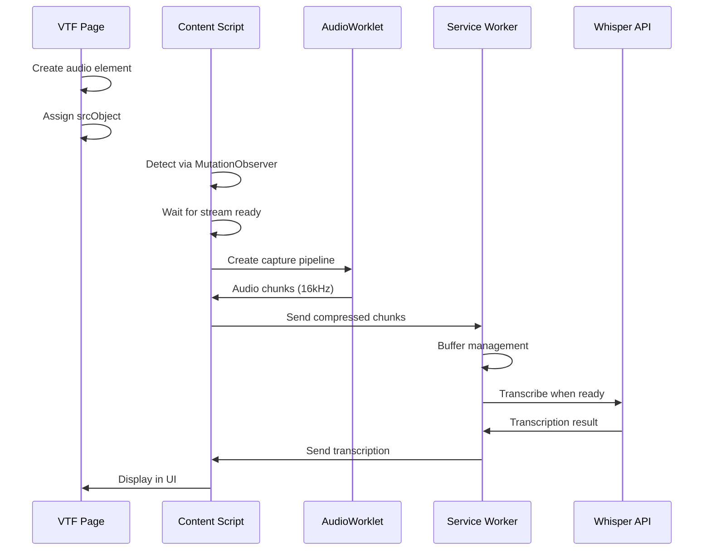

# VTF Audio Extension - Complete Design Document v0.5.0

## Executive Summary

This document provides the complete design for refactoring the VTF Audio Transcription Chrome Extension. It incorporates full compliance with VTF's MediaSoup-based audio system, eliminates all fragile hacks, and implements production-ready patterns based on QA feedback. The extension is optimized for macOS Chrome and single-user operation.

## Table of Contents

1. [Current State Analysis](#current-state-analysis)
2. [VTF System Analysis](#vtf-system-analysis)
3. [Design Goals](#design-goals)
4. [System Architecture](#system-architecture)
5. [Component Specifications](#component-specifications)
6. [Implementation Strategy](#implementation-strategy)
7. [Testing Strategy](#testing-strategy)
8. [Security & Privacy](#security-privacy)
9. [Migration Plan](#migration-plan)
10. [Risk Mitigation](#risk-mitigation)
11. [Performance Optimization](#performance-optimization)
12. [Success Metrics](#success-metrics)

## Current State Analysis

### Working Features
- Basic audio capture from VTF elements using inject.js → content.js → background.js relay
- Whisper API integration for transcription
- Hardcoded speaker identification
- Adaptive buffering with silence detection

### Critical Issues

1. **srcObject Override Hack**
   - Monkey-patches HTMLMediaElement prototype
   - Fragile and could break with Chrome updates
   - Creates timing dependencies

2. **Three-Layer Message Relay**
   - Unnecessary complexity: inject.js → content.js → background.js
   - Performance overhead from multiple serializations
   - Difficult to debug and maintain

3. **Deprecated ScriptProcessorNode**
   - Runs on main thread causing UI jank
   - Scheduled for removal from Chrome
   - Poor performance with multiple streams

4. **Timing Assumptions**
   - Hardcoded setTimeout delays (100ms, 500ms)
   - Race conditions under load
   - Unreliable stream detection

5. **Incomplete VTF Integration**
   - Missing consumer tracking
   - No transport event handling
   - Lacks retry logic matching VTF patterns
   - No session state synchronization

## VTF System Analysis

Based on the VTF Audio System Technical Specification v2.0:

### Core Architecture
```
MediaSoup Service → Consumer → Track → MediaStream → Audio Element → DOM
```

### Key Patterns

1. **Audio Element Management**
   ```javascript
   // Element ID pattern
   const elementId = `msRemAudio-${userData.userID}`;
   
   // Element lifecycle
   - Created when user joins
   - Reused on pause/resume
   - Only removed during reconnectAudio()
   ```

2. **Stream Assignment**
   ```javascript
   // VTF's implementation
   const stream = new MediaStream();
   stream.addTrack(consumer.track);
   audioElement.srcObject = stream;
   audioElement.volume = this.globals.audioVolume;
   audioElement.play();
   ```

3. **Error Recovery**
   ```javascript
   // Exponential backoff pattern
   const backoff = Math.min(1000 * Math.pow(2, retryCount), 30000);
   setTimeout(() => retry(), backoff);
   ```

4. **State Management**
   - Session states: 'open', 'closed'
   - Global volume: 0.0-1.0 decimal
   - Active users: talkingUsers Map

## Design Goals

1. **Full VTF Compliance**: Implement all patterns from VTF specification
2. **Zero Hacks**: No monkey-patching or property overrides
3. **Modern APIs**: AudioWorklet instead of ScriptProcessor
4. **Reliability**: <1% failure rate with automatic recovery
5. **Performance**: <100ms latency, no UI jank
6. **Maintainability**: Clean architecture, comprehensive logging

## System Architecture

### High-Level Design

```
VTF MediaSoup Service
    ↓
Consumer Created → Track Added → Audio Element Created
    ↓
VTF Audio Extension (Content Script)
    ├─→ VTF Globals Finder (Robust detection)
    ├─→ DOM Observer (MutationObserver on #topRoomDiv)
    ├─→ Stream Monitor (Track-based detection, no override)
    ├─→ Audio Capture (AudioWorklet with fallback)
    └─→ Data Transfer (Chunked, compressed)
         ↓
Service Worker (Background)
    ├─→ Buffer Manager (Per-user, VTF-aware)
    ├─→ Whisper Client (Local or remote)
    └─→ Transcription Delivery
         ↓
UI Components (Popup/Display)
```

### Component Interactions



## Component Specifications

### 1. Content Script (content.js)

The main orchestrator that coordinates all extension functionality.

```javascript
class VTFAudioExtension {
  constructor() {
    // Core components
    this.globalsFinder = new VTFGlobalsFinder();
    this.audioCapture = new VTFAudioCapture();
    this.streamMonitor = new VTFStreamMonitor();
    this.stateMonitor = new VTFStateMonitor();
    this.dataTransfer = new AudioDataTransfer();
    
    // State tracking
    this.audioElements = new Map();      // userId -> element
    this.activeCaptures = new Map();     // userId -> capture info
    this.streamMonitors = new Map();     // userId -> monitor info
    
    // Configuration
    this.config = {
      pollInterval: 50,          // ms - for stream detection
      globalsTimeout: 30000,     // ms - max wait for VTF globals
      captureTimeout: 5000,      // ms - max wait for stream ready
      statesSyncInterval: 1000   // ms - state synchronization
    };
  }
  
  async init() {
    console.log('[VTF Extension] Initializing...');
    
    // Phase 1: Wait for VTF globals
    const globalsFound = await this.globalsFinder.waitForGlobals(
      this.config.globalsTimeout / 500, // max retries
      500 // interval
    );
    
    if (!globalsFound) {
      console.error('[VTF Extension] Failed to find VTF globals');
      this.showError('VTF Extension: Unable to initialize');
      return;
    }
    
    // Phase 2: Initialize audio subsystem
    try {
      await this.audioCapture.initialize();
    } catch (error) {
      console.error('[VTF Extension] Audio initialization failed:', error);
      this.showError('VTF Extension: Audio system error');
      return;
    }
    
    // Phase 3: Set up monitoring
    this.setupDOMObserver();
    this.hookVTFFunctions();
    this.stateMonitor.startSync(this.globalsFinder, this.config.statesSyncInterval);
    
    // Phase 4: Process existing elements
    this.scanExistingElements();
    
    // Phase 5: Set up message handlers
    this.setupMessageHandlers();
    
    console.log('[VTF Extension] Initialization complete');
  }
  
  setupDOMObserver() {
    const observer = new MutationObserver((mutations) => {
      mutations.forEach((mutation) => {
        mutation.addedNodes.forEach((node) => {
          if (this.isVTFAudioElement(node)) {
            this.handleNewAudioElement(node);
          }
        });
        
        mutation.removedNodes.forEach((node) => {
          if (this.isVTFAudioElement(node)) {
            this.handleRemovedAudioElement(node);
          }
        });
      });
    });
    
    const target = document.getElementById('topRoomDiv') || document.body;
    observer.observe(target, {
      childList: true,
      subtree: false // VTF adds directly to topRoomDiv
    });
    
    console.log('[VTF Extension] DOM observer started on', target.id || 'body');
  }
  
  isVTFAudioElement(node) {
    return node.nodeType === Node.ELEMENT_NODE &&
           node.nodeName === 'AUDIO' && 
           node.id && 
           node.id.startsWith('msRemAudio-');
  }
  
  handleNewAudioElement(element) {
    const userId = element.id.replace('msRemAudio-', '');
    console.log(`[VTF Extension] New audio element detected: ${userId}`);
    
    this.audioElements.set(userId, element);
    this.streamMonitor.startMonitoring(element, userId, (stream) => {
      this.handleStreamAssigned(element, stream, userId);
    });
  }
  
  async handleStreamAssigned(element, stream, userId) {
    console.log(`[VTF Extension] Stream assigned to ${userId}`);
    
    try {
      // Wait for stream to be ready
      await this.streamMonitor.waitForStreamReady(stream);
      
      // Start audio capture
      await this.audioCapture.captureElement(element, stream, userId);
      
      // Update state
      this.activeCaptures.set(userId, {
        element,
        stream,
        startTime: Date.now()
      });
      
    } catch (error) {
      console.error(`[VTF Extension] Failed to capture ${userId}:`, error);
      this.handleCaptureError(userId, error);
    }
  }
}
```

### 2. VTF Globals Finder (vtf-globals-finder.js)

Robustly locates VTF global objects without timing assumptions.

```javascript
class VTFGlobalsFinder {
  constructor() {
    this.searchPaths = [
      'window.globals',
      'window.appService.globals',
      'window.mediaSoupService',
      'window.app.globals',
      'window.vtf.globals',
      'window.t3.globals'
    ];
    
    this.functionSignatures = [
      'startListeningToPresenter',
      'stopListeningToPresenter',
      'reconnectAudio',
      'adjustVol'
    ];
    
    this.globals = null;
    this.mediaSoupService = null;
  }
  
  async waitForGlobals(maxRetries = 60, interval = 500) {
    console.log('[VTF Globals] Starting search...');
    
    for (let i = 0; i < maxRetries; i++) {
      if (this.findGlobals()) {
        console.log(`[VTF Globals] Found after ${i * interval}ms`);
        return true;
      }
      
      if (i % 10 === 0 && i > 0) {
        console.log(`[VTF Globals] Still searching... (${i * interval}ms)`);
      }
      
      await new Promise(resolve => setTimeout(resolve, interval));
    }
    
    console.error(`[VTF Globals] Not found after ${maxRetries * interval}ms`);
    return false;
  }
  
  findGlobals() {
    // Method 1: Search known paths
    for (const path of this.searchPaths) {
      try {
        const obj = this.resolvePath(path);
        if (this.isValidGlobals(obj)) {
          this.globals = obj;
          console.log('[VTF Globals] Found at path:', path);
          this.findRelatedServices();
          return true;
        }
      } catch (e) {
        // Continue searching
      }
    }
    
    // Method 2: Search by function signatures
    if (this.findByFunctions()) {
      return true;
    }
    
    // Method 3: Search by jQuery selectors (VTF uses jQuery)
    if (this.findByJQuery()) {
      return true;
    }
    
    return false;
  }
  
  resolvePath(path) {
    return path.split('.').reduce((obj, key) => obj?.[key], window);
  }
  
  isValidGlobals(obj) {
    if (!obj || typeof obj !== 'object') return false;
    
    // Check for expected properties
    const markers = ['audioVolume', 'sessData', 'preferences', 'videoDeviceID'];
    return markers.some(marker => obj.hasOwnProperty(marker));
  }
  
  findByFunctions() {
    for (const funcName of this.functionSignatures) {
      if (typeof window[funcName] === 'function') {
        console.log('[VTF Globals] Found function:', funcName);
        
        // Try to extract globals from function context
        const funcStr = window[funcName].toString();
        if (funcStr.includes('this.globals') || funcStr.includes('globals.')) {
          console.log('[VTF Globals] Globals referenced in function');
          return true;
        }
      }
    }
    return false;
  }
  
  findByJQuery() {
    if (typeof $ !== 'undefined' || typeof jQuery !== 'undefined') {
      const $ = window.$ || window.jQuery;
      
      // Check if VTF's audio elements exist
      const audioElements = $("[id^='msRemAudio-']");
      if (audioElements.length > 0) {
        console.log('[VTF Globals] Found VTF audio elements via jQuery');
        return true;
      }
    }
    return false;
  }
  
  findRelatedServices() {
    // Look for MediaSoup service
    const servicePaths = [
      'window.mediaSoupService',
      'window.appService.mediaSoupService',
      'window.services.mediaSoup'
    ];
    
    for (const path of servicePaths) {
      const service = this.resolvePath(path);
      if (service && typeof service.startListeningToPresenter === 'function') {
        this.mediaSoupService = service;
        console.log('[VTF Globals] Found MediaSoup service at:', path);
        break;
      }
    }
  }
}
```

### 3. Stream Monitor (vtf-stream-monitor.js)

Detects stream assignment without monkey-patching.

```javascript
class VTFStreamMonitor {
  constructor() {
    this.monitors = new Map();
  }
  
  startMonitoring(element, userId, callback) {
    // Check if already has stream
    if (element.srcObject) {
      callback(element.srcObject);
      return;
    }
    
    // Set up polling (no property override!)
    const monitor = {
      element,
      userId,
      callback,
      pollInterval: null,
      pollCount: 0,
      maxPolls: 100 // 5 seconds at 50ms intervals
    };
    
    monitor.pollInterval = setInterval(() => {
      if (element.srcObject) {
        console.log(`[Stream Monitor] Stream detected for ${userId} after ${monitor.pollCount * 50}ms`);
        clearInterval(monitor.pollInterval);
        this.monitors.delete(userId);
        callback(element.srcObject);
      } else if (++monitor.pollCount >= monitor.maxPolls) {
        console.warn(`[Stream Monitor] Timeout waiting for stream ${userId}`);
        clearInterval(monitor.pollInterval);
        this.monitors.delete(userId);
      }
    }, 50);
    
    this.monitors.set(userId, monitor);
  }
  
  async waitForStreamReady(stream) {
    return new Promise((resolve, reject) => {
      const timeout = setTimeout(() => {
        reject(new Error('Stream ready timeout'));
      }, 5000);
      
      const checkReady = () => {
        if (!stream.active) {
          reject(new Error('Stream inactive'));
          return;
        }
        
        const audioTracks = stream.getAudioTracks();
        if (audioTracks.length === 0) {
          reject(new Error('No audio tracks'));
          return;
        }
        
        const track = audioTracks[0];
        if (track.readyState === 'live' && !track.muted) {
          clearTimeout(timeout);
          resolve(stream);
        } else {
          requestAnimationFrame(checkReady);
        }
      };
      
      // Start checking
      checkReady();
    });
  }
  
  stopMonitoring(userId) {
    const monitor = this.monitors.get(userId);
    if (monitor) {
      clearInterval(monitor.pollInterval);
      this.monitors.delete(userId);
    }
  }
}
```

### 4. Audio Capture (vtf-audio-capture.js)

Modern audio processing with AudioWorklet and fallback.

```javascript
class VTFAudioCapture {
  constructor() {
    this.audioContext = null;
    this.workletReady = false;
    this.captures = new Map();
    this.dataTransfer = null;
  }
  
  async initialize() {
    // Create audio context with optimal settings
    this.audioContext = new (window.AudioContext || window.webkitAudioContext)({
      sampleRate: 16000,      // Optimal for Whisper
      latencyHint: 'interactive'
    });
    
    // Initialize data transfer
    this.dataTransfer = new AudioDataTransfer();
    
    // Try to load AudioWorklet
    try {
      await this.audioContext.audioWorklet.addModule(
        chrome.runtime.getURL('audio-worklet.js')
      );
      this.workletReady = true;
      console.log('[Audio Capture] AudioWorklet initialized');
    } catch (error) {
      console.warn('[Audio Capture] AudioWorklet failed, using fallback:', error);
      this.workletReady = false;
    }
  }
  
  async captureElement(element, stream, userId) {
    console.log(`[Audio Capture] Starting capture for ${userId}`);
    
    // Check if already capturing
    if (this.captures.has(userId)) {
      console.warn(`[Audio Capture] Already capturing ${userId}`);
      return;
    }
    
    try {
      // Get audio track
      const audioTracks = stream.getAudioTracks();
      if (audioTracks.length === 0) {
        throw new Error('No audio tracks in stream');
      }
      
      const track = audioTracks[0];
      
      // Create source
      const source = this.audioContext.createMediaStreamSource(stream);
      
      // Create gain node for volume control
      const gainNode = this.audioContext.createGain();
      gainNode.gain.value = this.getVTFVolume();
      
      // Create processor
      let processor;
      if (this.workletReady) {
        processor = await this.createWorkletProcessor(userId);
      } else {
        processor = this.createScriptProcessor(userId);
      }
      
      // Connect audio graph
      source.connect(gainNode);
      gainNode.connect(processor);
      processor.connect(this.audioContext.destination);
      
      // Store capture info
      const capture = {
        element,
        stream,
        track,
        source,
        gainNode,
        processor,
        startTime: Date.now(),
        sampleCount: 0
      };
      
      this.captures.set(userId, capture);
      
      // Monitor track state
      track.onended = () => {
        console.log(`[Audio Capture] Track ended for ${userId}`);
        this.stopCapture(userId);
      };
      
      track.onmute = () => {
        console.log(`[Audio Capture] Track muted for ${userId}`);
      };
      
      track.onunmute = () => {
        console.log(`[Audio Capture] Track unmuted for ${userId}`);
      };
      
    } catch (error) {
      console.error(`[Audio Capture] Failed to capture ${userId}:`, error);
      throw error;
    }
  }
  
  async createWorkletProcessor(userId) {
    const processor = new AudioWorkletNode(
      this.audioContext, 
      'vtf-audio-processor',
      {
        processorOptions: { 
          userId,
          bufferSize: 4096 
        }
      }
    );
    
    processor.port.onmessage = (event) => {
      this.handleAudioData(userId, event.data);
    };
    
    return processor;
  }
  
  createScriptProcessor(userId) {
    const processor = this.audioContext.createScriptProcessor(4096, 1, 1);
    
    processor.onaudioprocess = (event) => {
      const inputData = event.inputBuffer.getChannelData(0);
      
      // Skip silence
      const maxSample = Math.max(...inputData.map(Math.abs));
      if (maxSample < 0.001) return;
      
      this.handleAudioData(userId, {
        samples: Array.from(inputData),
        timestamp: event.playbackTime
      });
    };
    
    return processor;
  }
  
  handleAudioData(userId, data) {
    const capture = this.captures.get(userId);
    if (!capture) return;
    
    capture.sampleCount += data.samples.length;
    
    // Send to background via data transfer
    this.dataTransfer.sendAudioData(userId, data.samples);
  }
  
  getVTFVolume() {
    // Try multiple paths to find volume
    return window.globals?.audioVolume || 
           window.appService?.globals?.audioVolume || 
           1.0;
  }
  
  updateVolume(volume) {
    this.captures.forEach((capture) => {
      if (capture.gainNode) {
        capture.gainNode.gain.value = volume;
      }
    });
  }
  
  stopCapture(userId) {
    const capture = this.captures.get(userId);
    if (!capture) return;
    
    console.log(`[Audio Capture] Stopping capture for ${userId}`);
    
    try {
      // Disconnect nodes
      capture.source.disconnect();
      capture.gainNode.disconnect();
      capture.processor.disconnect();
      
      // Stop processor if worklet
      if (capture.processor.port) {
        capture.processor.port.postMessage({ command: 'stop' });
      }
    } catch (error) {
      console.error(`[Audio Capture] Error stopping ${userId}:`, error);
    }
    
    this.captures.delete(userId);
  }
}
```

### 5. Audio Data Transfer (audio-data-transfer.js)

Optimized chunked transfer to service worker.

```javascript
class AudioDataTransfer {
  constructor() {
    this.CHUNK_SIZE = 16384;      // 1 second at 16kHz
    this.pendingChunks = new Map();
    this.transferStats = {
      bytesSent: 0,
      chunksSent: 0,
      errors: 0
    };
  }
  
  sendAudioData(userId, samples) {
    try {
      // Convert to Int16 for 50% size reduction
      const int16Data = this.float32ToInt16(samples);
      
      // Get or create pending buffer
      if (!this.pendingChunks.has(userId)) {
        this.pendingChunks.set(userId, []);
      }
      
      const pending = this.pendingChunks.get(userId);
      pending.push(...int16Data);
      
      // Send complete chunks
      while (pending.length >= this.CHUNK_SIZE) {
        const chunk = pending.splice(0, this.CHUNK_SIZE);
        this.sendChunk(userId, chunk);
      }
      
    } catch (error) {
      console.error('[Data Transfer] Error processing audio:', error);
      this.transferStats.errors++;
    }
  }
  
  sendChunk(userId, chunk) {
    const message = {
      type: 'audioChunk',
      userId,
      chunk: Array.from(chunk), // Convert for serialization
      timestamp: Date.now(),
      sampleRate: 16000
    };
    
    try {
      chrome.runtime.sendMessage(message);
      this.transferStats.chunksSent++;
      this.transferStats.bytesSent += chunk.length * 2;
    } catch (error) {
      console.error('[Data Transfer] Failed to send chunk:', error);
      this.transferStats.errors++;
    }
  }
  
  float32ToInt16(float32Array) {
    const int16Array = new Int16Array(float32Array.length);
    for (let i = 0; i < float32Array.length; i++) {
      const val = Math.max(-1, Math.min(1, float32Array[i]));
      int16Array[i] = val < 0 ? val * 0x8000 : val * 0x7FFF;
    }
    return int16Array;
  }
  
  getStats() {
    return {
      ...this.transferStats,
      pendingUsers: this.pendingChunks.size,
      pendingBytes: Array.from(this.pendingChunks.values())
        .reduce((sum, chunks) => sum + chunks.length * 2, 0)
    };
  }
}
```

### 6. State Monitor (vtf-state-monitor.js)

Synchronizes with VTF global state.

```javascript
class VTFStateMonitor {
  constructor() {
    this.lastKnownState = {
      volume: 1.0,
      sessionState: 'unknown',
      talkingUsers: new Map(),
      reconnectCount: 0
    };
    
    this.callbacks = {
      onVolumeChanged: [],
      onSessionStateChanged: [],
      onReconnect: []
    };
  }
  
  startSync(globalsFinder, interval = 1000) {
    console.log('[State Monitor] Starting synchronization');
    
    setInterval(() => {
      this.syncState(globalsFinder);
    }, interval);
    
    // Also hook into VTF functions
    this.hookVTFFunctions(globalsFinder);
  }
  
  syncState(globalsFinder) {
    const globals = globalsFinder.globals;
    if (!globals) return;
    
    // Check volume
    const currentVolume = globals.audioVolume ?? 1.0;
    if (Math.abs(currentVolume - this.lastKnownState.volume) > 0.01) {
      console.log(`[State Monitor] Volume changed: ${this.lastKnownState.volume} → ${currentVolume}`);
      this.lastKnownState.volume = currentVolume;
      this.emit('onVolumeChanged', currentVolume);
    }
    
    // Check session state
    const sessionState = globals.sessData?.currentState || 'unknown';
    if (sessionState !== this.lastKnownState.sessionState) {
      console.log(`[State Monitor] Session state changed: ${this.lastKnownState.sessionState} → ${sessionState}`);
      this.lastKnownState.sessionState = sessionState;
      this.emit('onSessionStateChanged', sessionState);
    }
    
    // Check talking users (if available)
    const talkingUsers = globals.talkingUsers || globalsFinder.mediaSoupService?.talkingUsers;
    if (talkingUsers instanceof Map && talkingUsers.size !== this.lastKnownState.talkingUsers.size) {
      console.log(`[State Monitor] Talking users changed: ${this.lastKnownState.talkingUsers.size} → ${talkingUsers.size}`);
      this.lastKnownState.talkingUsers = new Map(talkingUsers);
    }
  }
  
  hookVTFFunctions(globalsFinder) {
    // Hook reconnectAudio
    const originalReconnect = window.reconnectAudio || globalsFinder.mediaSoupService?.reconnectAudio;
    if (originalReconnect) {
      const hookedReconnect = function() {
        console.log('[State Monitor] reconnectAudio called');
        this.lastKnownState.reconnectCount++;
        this.emit('onReconnect');
        return originalReconnect.apply(this, arguments);
      }.bind(this);
      
      if (window.reconnectAudio) window.reconnectAudio = hookedReconnect;
      if (globalsFinder.mediaSoupService) {
        globalsFinder.mediaSoupService.reconnectAudio = hookedReconnect;
      }
    }
    
    // Hook adjustVol
    const originalAdjustVol = window.adjustVol;
    if (originalAdjustVol) {
      window.adjustVol = function(event) {
        const result = originalAdjustVol.apply(this, arguments);
        // Volume will be detected in next sync
        return result;
      };
    }
  }
  
  on(event, callback) {
    if (this.callbacks[event]) {
      this.callbacks[event].push(callback);
    }
  }
  
  emit(event, ...args) {
    if (this.callbacks[event]) {
      this.callbacks[event].forEach(cb => cb(...args));
    }
  }
  
  getState() {
    return { ...this.lastKnownState };
  }
}
```

### 7. AudioWorklet Processor (audio-worklet.js)

Modern audio processing on separate thread.

```javascript
// audio-worklet.js
class VTFAudioProcessor extends AudioWorkletProcessor {
  static get parameterDescriptors() {
    return [];
  }
  
  constructor(options) {
    super();
    
    // Configuration from options
    this.userId = options.processorOptions.userId;
    this.bufferSize = options.processorOptions.bufferSize || 4096;
    
    // Internal state
    this.buffer = [];
    this.isActive = true;
    
    // Handle control messages
    this.port.onmessage = (event) => {
      if (event.data.command === 'stop') {
        this.isActive = false;
      }
    };
  }
  
  process(inputs, outputs, parameters) {
    if (!this.isActive) return false;
    
    const input = inputs[0];
    if (!input || input.length === 0) return true;
    
    const channelData = input[0];
    if (!channelData || channelData.length === 0) return true;
    
    // Accumulate samples
    for (let i = 0; i < channelData.length; i++) {
      this.buffer.push(channelData[i]);
    }
    
    // Send complete buffers
    while (this.buffer.length >= this.bufferSize) {
      const chunk = this.buffer.splice(0, this.bufferSize);
      
      // Check for silence
      const maxSample = Math.max(...chunk.map(Math.abs));
      if (maxSample > 0.001) {
        this.port.postMessage({
          samples: chunk,
          timestamp: currentTime,
          userId: this.userId
        });
      }
    }
    
    return true; // Keep processor alive
  }
}

registerProcessor('vtf-audio-processor', VTFAudioProcessor);
```

### 8. Service Worker (background.js)

VTF-aware buffering and transcription management.

```javascript
// background.js - Service Worker
class VTFTranscriptionService {
  constructor() {
    // User buffer management
    this.userBuffers = new Map();      // userId -> BufferManager
    this.activeTranscriptions = new Map(); // userId -> Promise
    
    // Retry management
    this.retryCount = new Map();       // userId -> count
    this.lastError = new Map();        // userId -> error
    
    // Configuration
    this.config = {
      bufferDuration: 1.5,           // seconds before transcription
      maxBufferDuration: 30,         // maximum buffer size
      silenceTimeout: 2000,          // ms of silence before flush
      maxRetries: 5,
      initialBackoff: 1000,
      maxBackoff: 30000
    };
    
    // API configuration
    this.apiKey = null;
    this.whisperEndpoint = 'https://api.openai.com/v1/audio/transcriptions';
    
    // Speaker mapping
    this.speakerMap = new Map([
      ['XRcupJu26dK_sazaAAPK', 'DP'],
      ['Ixslfo7890K_bazaAAPK', 'Rickman'],
      ['O3e0pz1234K_cazaAAPK', 'Kira']
    ]);
    
    // Statistics
    this.stats = {
      chunksReceived: 0,
      transcriptionsSent: 0,
      errors: 0,
      totalDuration: 0
    };
  }
  
  async init() {
    // Load API key
    const storage = await chrome.storage.local.get(['openaiApiKey']);
    this.apiKey = storage.openaiApiKey;
    
    if (!this.apiKey) {
      console.error('[Service Worker] No API key configured');
    }
    
    // Set up message handlers
    chrome.runtime.onMessage.addListener((request, sender, sendResponse) => {
      this.handleMessage(request, sender)
        .then(response => sendResponse(response))
        .catch(error => sendResponse({ error: error.message }));
      return true; // Async response
    });
    
    console.log('[Service Worker] VTF Transcription Service initialized');
  }
  
  async handleMessage(request, sender) {
    switch (request.type) {
      case 'audioChunk':
        return this.handleAudioChunk(request);
        
      case 'startCapture':
        return this.handleStartCapture();
        
      case 'stopCapture':
        return this.handleStopCapture();
        
      case 'getStatus':
        return this.getStatus();
        
      case 'setApiKey':
        return this.setApiKey(request.apiKey);
        
      case 'reconnectAudio':
        return this.handleReconnect();
        
      default:
        throw new Error(`Unknown message type: ${request.type}`);
    }
  }
  
  async handleAudioChunk(request) {
    const { userId, chunk, timestamp, sampleRate } = request;
    
    this.stats.chunksReceived++;
    
    // Get or create buffer for user
    if (!this.userBuffers.has(userId)) {
      this.userBuffers.set(userId, new UserBufferManager(userId, this.config));
    }
    
    const buffer = this.userBuffers.get(userId);
    
    // Convert back to Float32
    const float32Data = this.int16ToFloat32(chunk);
    
    // Add to buffer
    buffer.addChunk(float32Data, timestamp);
    
    // Check if ready to transcribe
    if (buffer.isReadyToTranscribe()) {
      this.transcribeUserBuffer(userId);
    }
    
    return { received: true, bufferSize: buffer.getTotalSamples() };
  }
  
  async transcribeUserBuffer(userId) {
    // Prevent concurrent transcriptions for same user
    if (this.activeTranscriptions.has(userId)) {
      console.log(`[Service Worker] Transcription already active for ${userId}`);
      return;
    }
    
    const buffer = this.userBuffers.get(userId);
    if (!buffer || !buffer.hasData()) return;
    
    try {
      // Extract audio data
      const audioData = buffer.extractForTranscription();
      if (!audioData || audioData.samples.length === 0) return;
      
      // Mark as active
      const transcriptionPromise = this.performTranscription(userId, audioData);
      this.activeTranscriptions.set(userId, transcriptionPromise);
      
      // Wait for completion
      await transcriptionPromise;
      
      // Reset retry count on success
      this.retryCount.delete(userId);
      
    } catch (error) {
      console.error(`[Service Worker] Transcription error for ${userId}:`, error);
      this.handleTranscriptionError(userId, error);
      
    } finally {
      this.activeTranscriptions.delete(userId);
    }
  }
  
  async performTranscription(userId, audioData) {
    if (!this.apiKey) {
      throw new Error('No API key configured');
    }
    
    // Convert to WAV
    const wavBlob = this.createWAV(audioData.samples, 16000);
    
    // Create form data
    const formData = new FormData();
    formData.append('file', wavBlob, 'audio.wav');
    formData.append('model', 'whisper-1');
    formData.append('language', 'en');
    formData.append('response_format', 'json');
    
    // Call Whisper API
    const response = await fetch(this.whisperEndpoint, {
      method: 'POST',
      headers: {
        'Authorization': `Bearer ${this.apiKey}`
      },
      body: formData
    });
    
    if (!response.ok) {
      const error = await response.text();
      throw new Error(`Whisper API error: ${response.status} - ${error}`);
    }
    
    const result = await response.json();
    
    if (result.text && result.text.trim()) {
      const transcription = {
        userId,
        text: result.text.trim(),
        speaker: this.getSpeakerName(userId),
        timestamp: audioData.startTime,
        duration: audioData.samples.length / 16000
      };
      
      this.stats.transcriptionsSent++;
      this.stats.totalDuration += transcription.duration;
      
      // Send to content script
      this.broadcastTranscription(transcription);
    }
  }
  
  handleTranscriptionError(userId, error) {
    this.stats.errors++;
    this.lastError.set(userId, error);
    
    // Get retry count
    const retries = this.retryCount.get(userId) || 0;
    
    if (retries >= this.config.maxRetries) {
      console.error(`[Service Worker] Max retries reached for ${userId}`);
      this.userBuffers.get(userId)?.clear();
      return;
    }
    
    // Calculate backoff
    const backoff = Math.min(
      this.config.initialBackoff * Math.pow(2, retries),
      this.config.maxBackoff
    );
    
    console.log(`[Service Worker] Retrying ${userId} in ${backoff}ms (attempt ${retries + 1})`);
    
    this.retryCount.set(userId, retries + 1);
    
    setTimeout(() => {
      this.transcribeUserBuffer(userId);
    }, backoff);
  }
  
  broadcastTranscription(transcription) {
    // Send to all VTF tabs
    chrome.tabs.query({ url: '*://vtf.t3live.com/*' }, (tabs) => {
      tabs.forEach(tab => {
        chrome.tabs.sendMessage(tab.id, {
          type: 'transcription',
          data: transcription
        }).catch(() => {
          // Tab might not have content script
        });
      });
    });
  }
  
  getSpeakerName(userId) {
    // Check known mappings
    if (this.speakerMap.has(userId)) {
      return this.speakerMap.get(userId);
    }
    
    // Generate from userId
    const shortId = userId.substring(0, 6).toUpperCase();
    return `Speaker-${shortId}`;
  }
  
  handleReconnect() {
    console.log('[Service Worker] Handling VTF reconnect - clearing all buffers');
    
    // Clear all user buffers
    this.userBuffers.clear();
    this.activeTranscriptions.clear();
    this.retryCount.clear();
    this.lastError.clear();
    
    return { status: 'reconnected' };
  }
  
  getStatus() {
    const bufferStats = Array.from(this.userBuffers.entries()).map(([userId, buffer]) => ({
      userId,
      speaker: this.getSpeakerName(userId),
      samples: buffer.getTotalSamples(),
      duration: buffer.getTotalSamples() / 16000,
      isActive: this.activeTranscriptions.has(userId)
    }));
    
    return {
      hasApiKey: !!this.apiKey,
      stats: this.stats,
      activeUsers: this.userBuffers.size,
      buffers: bufferStats,
      errors: Array.from(this.lastError.entries()).map(([userId, error]) => ({
        userId,
        error: error.message
      }))
    };
  }
  
  // Audio format conversion utilities
  int16ToFloat32(int16Array) {
    const float32Array = new Float32Array(int16Array.length);
    for (let i = 0; i < int16Array.length; i++) {
      float32Array[i] = int16Array[i] / (int16Array[i] < 0 ? 0x8000 : 0x7FFF);
    }
    return float32Array;
  }
  
  createWAV(float32Array, sampleRate) {
    const length = float32Array.length;
    const buffer = new ArrayBuffer(44 + length * 2);
    const view = new DataView(buffer);
    
    // WAV header
    const writeString = (offset, string) => {
      for (let i = 0; i < string.length; i++) {
        view.setUint8(offset + i, string.charCodeAt(i));
      }
    };
    
    writeString(0, 'RIFF');
    view.setUint32(4, 36 + length * 2, true);
    writeString(8, 'WAVE');
    writeString(12, 'fmt ');
    view.setUint32(16, 16, true);
    view.setUint16(20, 1, true);
    view.setUint16(22, 1, true);
    view.setUint32(24, sampleRate, true);
    view.setUint32(28, sampleRate * 2, true);
    view.setUint16(32, 2, true);
    view.setUint16(34, 16, true);
    writeString(36, 'data');
    view.setUint32(40, length * 2, true);
    
    // Convert samples
    let offset = 44;
    for (let i = 0; i < length; i++) {
      const sample = Math.max(-1, Math.min(1, float32Array[i]));
      view.setInt16(offset, sample < 0 ? sample * 0x8000 : sample * 0x7FFF, true);
      offset += 2;
    }
    
    return new Blob([buffer], { type: 'audio/wav' });
  }
}

// User buffer management
class UserBufferManager {
  constructor(userId, config) {
    this.userId = userId;
    this.config = config;
    this.chunks = [];
    this.totalSamples = 0;
    this.lastActivity = Date.now();
    this.silenceTimer = null;
  }
  
  addChunk(samples, timestamp) {
    this.chunks.push({
      samples,
      timestamp,
      addedAt: Date.now()
    });
    
    this.totalSamples += samples.length;
    this.lastActivity = Date.now();
    
    // Reset silence timer
    this.resetSilenceTimer();
    
    // Trim if too large
    this.trimBuffer();
  }
  
  isReadyToTranscribe() {
    const duration = this.totalSamples / 16000;
    return duration >= this.config.bufferDuration;
  }
  
  extractForTranscription() {
    if (this.chunks.length === 0) return null;
    
    // Extract all samples
    const allSamples = [];
    const startTime = this.chunks[0].timestamp;
    
    this.chunks.forEach(chunk => {
      allSamples.push(...chunk.samples);
    });
    
    // Clear buffer
    this.chunks = [];
    this.totalSamples = 0;
    
    return {
      samples: allSamples,
      startTime,
      duration: allSamples.length / 16000
    };
  }
  
  resetSilenceTimer() {
    if (this.silenceTimer) {
      clearTimeout(this.silenceTimer);
    }
    
    this.silenceTimer = setTimeout(() => {
      if (this.hasData()) {
        console.log(`[Buffer] Silence timeout for ${this.userId} - forcing transcription`);
        // Trigger transcription via message
        chrome.runtime.sendMessage({
          type: 'forceTranscribe',
          userId: this.userId
        });
      }
    }, this.config.silenceTimeout);
  }
  
  trimBuffer() {
    const maxSamples = this.config.maxBufferDuration * 16000;
    
    while (this.totalSamples > maxSamples && this.chunks.length > 1) {
      const removed = this.chunks.shift();
      this.totalSamples -= removed.samples.length;
    }
  }
  
  hasData() {
    return this.totalSamples > 0;
  }
  
  getTotalSamples() {
    return this.totalSamples;
  }
  
  clear() {
    this.chunks = [];
    this.totalSamples = 0;
    if (this.silenceTimer) {
      clearTimeout(this.silenceTimer);
    }
  }
}

// Initialize service
const vtfService = new VTFTranscriptionService();
vtfService.init();