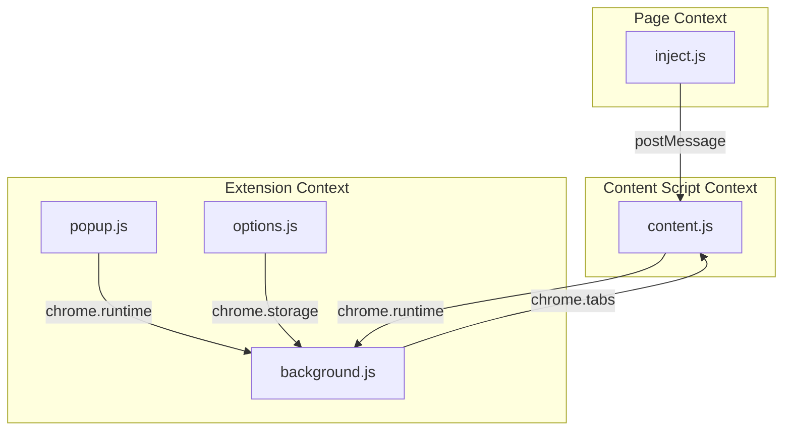

# VTF Audio Extension — Legacy Code Analysis

## 1. Architecture Overview

### High-Level Component Diagram

### Message Passing Flow

- **inject.js → content.js**: Uses window.postMessage with custom type (VTF_AUDIO_DATA) for audio data chunks.
- **content.js → background.js**: Uses chrome.runtime.sendMessage for audio data, control signals, and transcription updates.
- **background.js → content.js**: Uses chrome.tabs.sendMessage to push new transcriptions and buffer status.
- **popup.js → background.js/content.js**: Uses chrome.runtime.sendMessage and chrome.tabs.sendMessage for control commands (start/stop) and status queries.
- **options.js → background.js/storage**: Uses chrome.runtime.sendMessage to set API keys, and chrome.storage.local for persistent config.

### Data Flow: Audio Capture to Transcription

1. inject.js attaches to VTF audio elements, monitors srcObject, captures audio via Web Audio API (ScriptProcessorNode), and posts audio buffers to window.
2. content.js receives window messages, relays them to the extension context via chrome.runtime.sendMessage.
3. background.js buffers and merges audio by speaker, applies adaptive chunking, silence detection, converts PCM to WAV, and sends to OpenAI Whisper API.
4. Transcriptions are sent back to content script for visual display and popup for user review.

## 2. Component Analysis

### inject.js

- **Purpose**: Injected into VTF's DOM. Captures audio from all VTF audio elements and proxies their streams for recording/transcription.
- **Key Functions**:
  - monitorStreamChanges — Proxies the srcObject property for VTF <audio> elements, triggers capture on stream changes.
  - captureAudioElement — Sets up Web Audio processing pipeline.
  - stopCapture — Tears down and cleans up pipeline.
- **Dependencies**:
  - Web Audio API (AudioContext, MediaStreamSource, ScriptProcessorNode).
  - Direct DOM access and mutation observer on VTF's DOM.
- **Message Types**:
  - Sends VTF_AUDIO_DATA via window.postMessage.
- **State Management**:
  - Tracks active processors and monitored streams via Map.
  - Handles periodic clean-up on element removal or stream change.
- **Issues Found**:
  - Reliant on VTF element IDs and structure—brittle if VTF changes DOM.
  - Uses ScriptProcessorNode (deprecated in favor of AudioWorklet for future-proofing).
  - Volume monitoring logic is unused.
  - Audio context lifecycle is only partly managed (could leak if user navigates away).
  - Stream ID and speaker mapping is hardcoded.

### content.js

- **Purpose**: Bridge between injected page context and the extension (background). Forwards audio, receives UI/display updates.
- **Key Functions**:
  - Injects inject.js.
  - Listens for VTF_AUDIO_DATA, relays to background.
  - Handles extension reloads/errors, displays notifications.
  - Manages in-page transcription display and status overlays.
- **Dependencies**:
  - Depends on inject.js to be loaded in page.
  - DOM manipulation for notifications and overlays.
- **Message Types**:
  - Receives: VTF_AUDIO_DATA (window), newTranscription, buffer_status (extension).
  - Sends: audioData (background), UI control messages.
- **State Management**:
  - Tracks chunks sent, last transcription for merging.
  - In-DOM state for overlays and notifications.
- **Issues Found**:
  - DOM manipulation is tightly coupled and scattered.
  - No cleanup for overlays on extension reload.
  - Notification stack could become orphaned on reloads/crashes.

### background.js

- **Purpose**: Central processing, buffering, merging, and transcription orchestration.
- **Key Functions**:
  - Speaker-aware buffer management, chunking, silence detection.
  - Handles concurrent processing.
  - Calls OpenAI Whisper API, converts Float32 PCM to WAV.
  - Speaker merge logic and activity tracking.
- **Dependencies**:
  - OpenAI Whisper API (API key from storage).
  - Chrome extension messaging and storage.
- **Message Types**:
  - Receives: audioData, startCapture, stopCapture, getStatus, getTranscriptions, setApiKey.
  - Sends: newTranscription, buffer_status (to all VTF tabs).
- **State Management**:
  - Buffers, per-speaker, and global.
  - Concurrency management with processingQueue.
  - Speaker merge and activity windows.
- **Issues Found**:
  - Complex, heavily stateful; multiple possible edge cases.
  - No full lifecycle management (extension reload or API failure).
  - Speaker mapping is static, not dynamically learned.
  - Audio chunk boundaries and adaptive timing are tuned, but not robust to very slow/fast speech or laggy tabs.

### popup.js

- **Purpose**: User UI for start/stop, viewing status, and reviewing transcriptions.
- **Key Functions**:
  - Sends start/stop commands to page/background.
  - Displays connection/test errors.
  - Polls status and displays summary stats.
  - Loads and shows last transcriptions.
- **Dependencies**:
  - Depends on DOM (popup.html structure) and background messaging.
- **Message Types**:
  - Sends: start_capture, stop_capture, getStatus, getTranscriptions.
- **State Management**:
  - Simple in-memory booleans and DOM element references.
- **Issues Found**:
  - Repeats status polling (could optimize with events).
  - Assumes only one VTF tab.
  - Minimal error recovery (UI can desync if content/background fail).

### options.js

- **Purpose**: Settings/config management. Lets user set and persist OpenAI API key.
- **Key Functions**:
  - Load/save API key to chrome.storage.local.
  - UI for show/hide password.
  - Keyboard shortcut for debug dump.
- **Dependencies**:
  - Chrome extension storage API.
- **Message Types**:
  - Sends: setApiKey (to background).
- **State Management**:
  - DOM-driven only.
- **Issues Found**:
  - Basic UX, no feedback if background is dead.
  - Key validation only checks for sk- prefix.

### manifest.json

- **Purpose**: Chrome manifest (v3). Declares scripts, permissions, content scripts, options page, and resources.
- **Key Functions**:
  - Permissions: "storage", "tabs", "host_permissions" for OpenAI.
  - Declares service worker, content scripts, popup, options.
- **Dependencies**:
  - OpenAI API, VTF site.
- **Issues Found**:
  - Permissions are fine; no unused permissions found.

### style.css

- **Purpose**: Provides visual styles for popup and options UI.

## 3. Audio Capture Implementation

- **Method**: Uses Web Audio API's ScriptProcessorNode (deprecated in spec, but still widely supported). 4096-frame buffer, mono channel, 16kHz.
- **Buffer Management**: Buffers in inject.js per audio element, per speaker. Background.js further merges and chunks by speaker, with adaptive chunking and silence detection.
- **Sample Rate/Processing**: AudioContext set to 16,000 Hz for Whisper compatibility. Chunks are ~1 second by default (16,000 samples), with partial chunks on silence.
- **Data Transfer**:
  - Page context → content script: window postMessage (VTF_AUDIO_DATA)
  - Content script → background: chrome.runtime.sendMessage (audioData)

## 4. VTF Integration Points

- **Audio Element Detection**: Observes DOM for <audio> elements with IDs matching msRemAudio-*.
- **srcObject Override**: Uses a custom setter via Object.defineProperty to watch for changes to srcObject, enabling re-capture when VTF swaps streams.
- **Timing Dependencies**: Small delay after srcObject is set to ensure VTF is ready before capturing. Also, uses MutationObserver to detect DOM changes for reconnects.
- **Speaker Identification**: Extracts speaker from streamId (e.g., msRemAudio-XRcupJ). Maps hardcoded IDs to names (DP, Rickman, Kira, etc.). No dynamic or user-driven speaker mapping.

## 5. Technical Debt Inventory

### Critical Issues (Must fix in refactor)

- ScriptProcessorNode is deprecated: Should migrate to AudioWorklet for future compatibility and lower latency.
- Tight coupling to VTF DOM/IDs: If VTF changes DOM or stream ID logic, extension may break. Should provide a fallback/discovery mechanism and robust selectors.
- Speaker mapping is static: Should be dynamic or at least user-extendable/configurable.
- **Error Handling and Resilience**:
  - Buffer overruns/underruns and extension reloads can leave orphaned state.
  - Whisper API/network errors may cause audio loss or extension crashes.
- **State Cleanup**: AudioContext and processors may leak or persist if tabs are left open or extension is updated.

### Code Smells (Should improve)

- Inline DOM manipulation and scattered UI logic (content.js).
- Mixed sync/async state updates in popup and background.
- Direct mutation of global state; should favor class-based encapsulation or modular architecture.

### Performance Concerns

- Reliance on periodic polling in popup/content/background.
- Potential for memory leaks with many speakers/elements.
- No batching or rate-limiting for Whisper API requests.
- Use of setTimeout-based retries instead of a job/task queue.

### Security/Privacy

- API key stored in plain chrome.storage (standard for extensions, but ideally could be obfuscated).
- No handling for accidental key leakage (UI improvement only).
- Possible exposure of user audio data if a tab is hijacked or if cross-site scripting is present in VTF.

## 6. Dependency Map

## Recommendations for Refactor

- Replace ScriptProcessorNode with AudioWorklet for low-latency, future-proof audio processing.
- Modularize buffer and speaker management in background.js to be extensible and easier to test.
- Refactor UI layers (content/popup) for separation of concerns (consider MVVM or similar).
- Robust VTF element detection with fallback and error messages.
- Dynamic speaker ID mapping and UI for manual corrections.
- Centralize error handling, lifecycle, and cleanup.
- Automated tests and mocks for each key processing module (buffering, merging, API calls).

