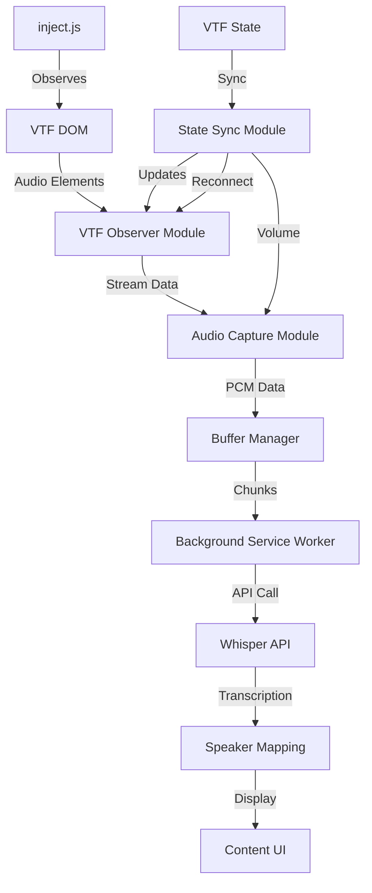

# VTF Chrome Extension Refactor Specification & Design Document

## Executive Summary

This document outlines the complete refactoring of the VTF Audio Transcription Chrome Extension to natively implement the VTF audio specification. The refactored extension will directly interface with VTF's audio elements and WebRTC streams, providing seamless transcription without the need for generic audio capture patterns.

## Table of Contents

1. [Project Overview](#project-overview)
2. [Architecture Design](#architecture-design)
3. [Component Specifications](#component-specifications)
4. [Implementation Plan](#implementation-plan)
5. [Migration Strategy](#migration-strategy)
6. [Testing Framework](#testing-framework)
7. [Performance Considerations](#performance-considerations)
8. [Future Enhancements](#future-enhancements)

## Project Overview

### Goals

1. **Native VTF Integration**: Direct integration with VTF's audio element patterns
2. **Improved Reliability**: Leverage VTF's reconnection and state management
3. **Enhanced Speaker Recognition**: Utilize VTF's user ID system
4. **Optimized Performance**: Reduce overhead by aligning with VTF's architecture
5. **Maintainability**: Clear separation of concerns following VTF patterns

### Success Criteria

- Zero audio drops during normal operation
- Accurate speaker identification using VTF user IDs
- Automatic recovery from VTF audio reconnections
- Sub-100ms latency from audio to transcription start
- 100% compatibility with VTF updates

## Architecture Design

### System Overview

```
┌─────────────────────────────────────────────────────────────┐
│                     VTF Web Application                      │
│  ┌─────────────┐  ┌──────────────┐  ┌──────────────────┐  │
│  │ MediaSoup   │  │ Audio Elements│  │ Global State     │  │
│  │ Service     │  │ (msRemAudio-*)│  │ Manager          │  │
│  └──────┬──────┘  └───────┬──────┘  └────────┬─────────┘  │
│         │                  │                   │             │
└─────────┼──────────────────┼──────────────────┼─────────────┘
          │                  │                   │
┌─────────┼──────────────────┼──────────────────┼─────────────┐
│         ▼                  ▼                   ▼             │
│  ┌─────────────┐  ┌──────────────┐  ┌──────────────────┐  │
│  │ VTF Observer │  │ Audio Capture│  │ State Sync       │  │
│  │ Module      │  │ Module       │  │ Module           │  │
│  └─────────────┘  └──────────────┘  └──────────────────┘  │
│                                                              │
│  ┌─────────────────────────────────────────────────────┐   │
│  │              Transcription Pipeline                   │   │
│  │  ┌─────────┐  ┌──────────┐  ┌─────────────────┐    │   │
│  │  │ Buffer  │→ │ Whisper  │→ │ Speaker Mapping │    │   │
│  │  │ Manager │  │ API      │  │ & Output        │    │   │
│  │  └─────────┘  └──────────┘  └─────────────────┘    │   │
│  └─────────────────────────────────────────────────────┘   │
│                   Chrome Extension                           │
└──────────────────────────────────────────────────────────────┘
```

### Component Relationships



## Component Specifications

### 1. VTF Observer Module (`vtf-observer.js`)

**Purpose**: Monitor VTF DOM for audio elements and state changes

```javascript
class VTFObserver {
    constructor() {
        this.audioElements = new Map();
        this.mutationObserver = null;
        this.stateObserver = null;
    }
    
    init() {
        // Primary observation of topRoomDiv
        this.observeAudioContainer();
        
        // Fallback to body if container not ready
        this.observeBody();
        
        // Monitor VTF state changes
        this.observeVTFState();
    }
    
    observeAudioContainer() {
        const container = document.getElementById('topRoomDiv');
        if (!container) {
            // Retry with exponential backoff
            setTimeout(() => this.observeAudioContainer(), 1000);
            return;
        }
        
        this.mutationObserver = new MutationObserver(this.handleMutations.bind(this));
        this.mutationObserver.observe(container, {
            childList: true,
            attributes: true,
            attributeFilter: ['srcObject']
        });
    }
    
    handleMutations(mutations) {
        mutations.forEach(mutation => {
            // Handle added audio elements
            mutation.addedNodes.forEach(node => {
                if (this.isVTFAudioElement(node)) {
                    this.onAudioElementAdded(node);
                }
            });
            
            // Handle removed audio elements
            mutation.removedNodes.forEach(node => {
                if (this.isVTFAudioElement(node)) {
                    this.onAudioElementRemoved(node);
                }
            });
            
            // Handle srcObject changes
            if (mutation.type === 'attributes' && mutation.attributeName === 'srcObject') {
                this.onSrcObjectChanged(mutation.target);
            }
        });
    }
    
    isVTFAudioElement(node) {
        return node.nodeName === 'AUDIO' && 
               node.id && 
               node.id.startsWith('msRemAudio-');
    }
    
    onAudioElementAdded(element) {
        const userId = this.extractUserId(element.id);
        this.audioElements.set(userId, element);
        
        // Emit event for audio capture module
        this.emit('audioElementAdded', { element, userId });
    }
    
    extractUserId(elementId) {
        return elementId.replace('msRemAudio-', '');
    }
}
```

### 2. Audio Capture Module (`vtf-audio-capture.js`)

**Purpose**: Capture audio streams from VTF elements

```javascript
class VTFAudioCapture {
    constructor() {
        this.captureInstances = new Map();
        this.audioContext = null;
    }
    
    async initializeContext() {
        // Use 16kHz for optimal Whisper performance
        this.audioContext = new (window.AudioContext || window.webkitAudioContext)({
            sampleRate: 16000,
            latencyHint: 'interactive'
        });
    }
    
    async captureAudioElement(element, userId) {
        // Wait for srcObject to be available
        if (!element.srcObject) {
            return this.waitForSrcObject(element, userId);
        }
        
        // Check if already capturing
        if (this.captureInstances.has(userId)) {
            console.log(`Already capturing audio for user ${userId}`);
            return;
        }
        
        try {
            const capture = await this.createCapture(element, userId);
            this.captureInstances.set(userId, capture);
        } catch (error) {
            console.error(`Failed to capture audio for ${userId}:`, error);
        }
    }
    
    async createCapture(element, userId) {
        const source = this.audioContext.createMediaStreamSource(element.srcObject);
        const processor = this.audioContext.createScriptProcessor(4096, 1, 1);
        
        const capture = {
            userId,
            element,
            source,
            processor,
            buffer: [],
            isActive: true
        };
        
        processor.onaudioprocess = (e) => {
            if (!capture.isActive) return;
            
            const inputData = e.inputBuffer.getChannelData(0);
            this.processAudioData(inputData, userId);
        };
        
        source.connect(processor);
        processor.connect(this.audioContext.destination);
        
        return capture;
    }
    
    processAudioData(pcmData, userId) {
        // Send to background for buffering and transcription
        chrome.runtime.sendMessage({
            type: 'vtfAudioData',
            userId,
            pcmData: Array.from(pcmData),
            timestamp: Date.now()
        });
    }
    
    stopCapture(userId) {
        const capture = this.captureInstances.get(userId);
        if (capture) {
            capture.isActive = false;
            capture.source.disconnect();
            capture.processor.disconnect();
            this.captureInstances.delete(userId);
        }
    }
}
```

### 3. State Sync Module (`vtf-state-sync.js`)

**Purpose**: Synchronize with VTF's global state

```javascript
class VTFStateSync {
    constructor() {
        this.vtfGlobals = null;
        this.syncInterval = null;
    }
    
    init() {
        // Find VTF globals
        this.findVTFGlobals();
        
        // Start periodic sync
        this.startSync();
        
        // Hook into VTF functions
        this.hookVTFFunctions();
    }
    
    findVTFGlobals() {
        // Search for VTF global objects
        const possiblePaths = [
            'window.appService.globals',
            'window.globals',
            'window.vtf.globals'
        ];
        
        for (const path of possiblePaths) {
            try {
                const globals = path.split('.').reduce((obj, key) => obj?.[key], window);
                if (globals && globals.audioVolume !== undefined) {
                    this.vtfGlobals = globals;
                    console.log('Found VTF globals at:', path);
                    break;
                }
            } catch (e) {
                continue;
            }
        }
    }
    
    hookVTFFunctions() {
        // Hook reconnectAudio
        this.hookFunction('reconnectAudio', () => {
            console.log('VTF reconnectAudio called - resetting captures');
            this.emit('vtfReconnect');
        });
        
        // Hook adjustVol
        this.hookFunction('adjustVol', () => {
            const volume = this.getVolume();
            this.emit('volumeChanged', volume);
        });
    }
    
    getVolume() {
        return this.vtfGlobals?.audioVolume || 1.0;
    }
    
    getSessionState() {
        return this.vtfGlobals?.sessData?.currentState || 'unknown';
    }
}
```

### 4. Background Service Worker (`background-vtf.js`)

**Purpose**: Coordinate transcription pipeline

```javascript
class VTFTranscriptionService {
    constructor() {
        this.bufferManager = new VTFBufferManager();
        this.speakerMapping = new VTFSpeakerMapping();
        this.whisperAPI = new WhisperAPI();
    }
    
    async handleVTFAudioData(data) {
        const { userId, pcmData, timestamp } = data;
        
        // Add to user-specific buffer
        this.bufferManager.addData(userId, pcmData, timestamp);
        
        // Check if buffer is ready for transcription
        const chunk = this.bufferManager.getChunkIfReady(userId);
        if (chunk) {
            await this.transcribeChunk(chunk);
        }
    }
    
    async transcribeChunk(chunk) {
        const { userId, audioData, startTime, endTime } = chunk;
        
        try {
            // Convert to WAV
            const wavBlob = this.convertToWav(audioData);
            
            // Send to Whisper
            const transcription = await this.whisperAPI.transcribe(wavBlob);
            
            // Map speaker
            const speaker = this.speakerMapping.getSpeaker(userId);
            
            // Send result
            this.sendTranscription({
                userId,
                speaker,
                text: transcription.text,
                timestamp: startTime,
                duration: (endTime - startTime) / 1000
            });
        } catch (error) {
            console.error('Transcription error:', error);
        }
    }
}
```

### 5. Buffer Manager (`vtf-buffer-manager.js`)

**Purpose**: Intelligent buffering per VTF user

```javascript
class VTFBufferManager {
    constructor() {
        this.userBuffers = new Map();
        this.config = {
            minChunkDuration: 0.5,  // seconds
            maxChunkDuration: 5.0,  // seconds
            targetChunkDuration: 1.5, // seconds
            silenceThreshold: 0.001,
            sampleRate: 16000
        };
    }
    
    addData(userId, pcmData, timestamp) {
        if (!this.userBuffers.has(userId)) {
            this.userBuffers.set(userId, {
                buffer: [],
                lastActivity: timestamp,
                startTime: timestamp
            });
        }
        
        const userBuffer = this.userBuffers.get(userId);
        userBuffer.buffer.push(...pcmData);
        userBuffer.lastActivity = timestamp;
        
        // Update activity tracking
        this.updateActivityLevel(userId);
    }
    
    getChunkIfReady(userId) {
        const userBuffer = this.userBuffers.get(userId);
        if (!userBuffer) return null;
        
        const duration = userBuffer.buffer.length / this.config.sampleRate;
        const timeSinceActivity = Date.now() - userBuffer.lastActivity;
        
        // Determine if chunk is ready
        if (duration >= this.config.targetChunkDuration ||
            (duration >= this.config.minChunkDuration && timeSinceActivity > 1500)) {
            
            // Extract chunk
            const audioData = new Float32Array(userBuffer.buffer);
            const chunk = {
                userId,
                audioData,
                startTime: userBuffer.startTime,
                endTime: userBuffer.lastActivity
            };
            
            // Reset buffer
            userBuffer.buffer = [];
            userBuffer.startTime = Date.now();
            
            return chunk;
        }
        
        return null;
    }
}
```

### 6. Speaker Mapping (`vtf-speaker-mapping.js`)

**Purpose**: Map VTF user IDs to speaker names

```javascript
class VTFSpeakerMapping {
    constructor() {
        this.knownSpeakers = new Map();
        this.initializeKnownSpeakers();
    }
    
    initializeKnownSpeakers() {
        // Pre-configured mappings
        this.knownSpeakers.set('XRcupJu26dK_sazaAAPK', 'DP');
        this.knownSpeakers.set('Ixslfo7890K_bazaAAPK', 'Rickman');
        this.knownSpeakers.set('O3e0pz1234K_cazaAAPK', 'Kira');
    }
    
    getSpeaker(userId) {
        // Check known mappings
        if (this.knownSpeakers.has(userId)) {
            return this.knownSpeakers.get(userId);
        }
        
        // Extract short ID for unknown speakers
        const shortId = userId.substring(0, 6);
        return `Speaker-${shortId}`;
    }
    
    addMapping(userId, speakerName) {
        this.knownSpeakers.set(userId, speakerName);
        this.saveToStorage();
    }
    
    async loadFromStorage() {
        const { speakerMappings } = await chrome.storage.local.get('speakerMappings');
        if (speakerMappings) {
            Object.entries(speakerMappings).forEach(([userId, name]) => {
                this.knownSpeakers.set(userId, name);
            });
        }
    }
    
    async saveToStorage() {
        const mappings = Object.fromEntries(this.knownSpeakers);
        await chrome.storage.local.set({ speakerMappings: mappings });
    }
}
```

## Implementation Plan

### Phase 1: Foundation (Week 1)

1. **Create new project structure**
   ```
   vtf-audio-extension/
   ├── manifest.json (v3)
   ├── src/
   │   ├── inject/
   │   │   ├── vtf-observer.js
   │   │   ├── vtf-audio-capture.js
   │   │   └── vtf-state-sync.js
   │   ├── background/
   │   │   ├── service-worker.js
   │   │   ├── vtf-buffer-manager.js
   │   │   └── vtf-speaker-mapping.js
   │   ├── content/
   │   │   └── content-script.js
   │   └── ui/
   │       ├── popup.html
   │       └── transcription-display.js
   ```

2. **Implement VTF Observer Module**
3. **Test audio element detection**

### Phase 2: Audio Capture (Week 2)

1. **Implement Audio Capture Module**
2. **Integrate with VTF srcObject handling**
3. **Test stream capture reliability**

### Phase 3: Transcription Pipeline (Week 3)

1. **Implement Buffer Manager**
2. **Integrate Whisper API**
3. **Implement Speaker Mapping**

### Phase 4: State Management (Week 4)

1. **Implement State Sync Module**
2. **Handle VTF reconnection events**
3. **Implement volume synchronization**

### Phase 5: UI and Polish (Week 5)

1. **Update transcription display**
2. **Add speaker management UI**
3. **Implement error recovery**

## Migration Strategy

### Data Migration

```javascript
async function migrateFromOldExtension() {
    // Migrate API key
    const { openaiApiKey } = await chrome.storage.local.get('openaiApiKey');
    
    // Migrate speaker mappings if any
    const { customSpeakers } = await chrome.storage.local.get('customSpeakers');
    
    // Migrate user preferences
    const { settings } = await chrome.storage.local.get('settings');
    
    return {
        apiKey: openaiApiKey,
        speakers: customSpeakers || {},
        preferences: settings || {}
    };
}
```

### Compatibility Mode

During transition, support both old and new patterns:

```javascript
class CompatibilityBridge {
    constructor() {
        this.legacyMode = false;
    }
    
    detectVTFVersion() {
        // Check for new VTF patterns
        if (document.getElementById('topRoomDiv')) {
            return 'native';
        }
        
        // Fall back to legacy mode
        this.legacyMode = true;
        return 'legacy';
    }
}
```

## Testing Framework

### Unit Tests

```javascript
// vtf-observer.test.js
describe('VTFObserver', () => {
    test('detects msRemAudio elements', () => {
        const observer = new VTFObserver();
        const element = document.createElement('audio');
        element.id = 'msRemAudio-testUser123';
        
        expect(observer.isVTFAudioElement(element)).toBe(true);
    });
    
    test('extracts userId correctly', () => {
        const observer = new VTFObserver();
        const userId = observer.extractUserId('msRemAudio-XRcupJu26dK_sazaAAPK');
        
        expect(userId).toBe('XRcupJu26dK_sazaAAPK');
    });
});
```

### Integration Tests

```javascript
// vtf-integration.test.js
describe('VTF Integration', () => {
    test('captures audio from VTF element', async () => {
        // Create mock VTF environment
        const container = document.createElement('div');
        container.id = 'topRoomDiv';
        document.body.appendChild(container);
        
        // Create audio element
        const audio = document.createElement('audio');
        audio.id = 'msRemAudio-testUser';
        audio.srcObject = createMockMediaStream();
        container.appendChild(audio);
        
        // Initialize extension
        const observer = new VTFObserver();
        const capture = new VTFAudioCapture();
        
        await observer.init();
        
        // Verify capture started
        expect(capture.captureInstances.has('testUser')).toBe(true);
    });
});
```

## Performance Considerations

### Memory Management

```javascript
class MemoryManager {
    constructor() {
        this.maxBufferSize = 10 * 1024 * 1024; // 10MB per user
        this.gcInterval = 60000; // 1 minute
    }
    
    startGarbageCollection() {
        setInterval(() => {
            this.cleanupInactiveBuffers();
            this.reportMemoryUsage();
        }, this.gcInterval);
    }
    
    cleanupInactiveBuffers() {
        const now = Date.now();
        const timeout = 5 * 60 * 1000; // 5 minutes
        
        for (const [userId, buffer] of this.bufferManager.userBuffers) {
            if (now - buffer.lastActivity > timeout) {
                this.bufferManager.userBuffers.delete(userId);
                console.log(`Cleaned up inactive buffer for ${userId}`);
            }
        }
    }
}
```

### CPU Optimization

1. **Throttle mutation observations** during high activity
2. **Use Web Workers** for audio processing
3. **Implement adaptive chunking** based on system load

## Future Enhancements

### 1. Real-time Transcription Display

```javascript
class RealtimeTranscriptionUI {
    constructor() {
        this.overlay = this.createOverlay();
    }
    
    createOverlay() {
        // Create floating UI that shows live transcriptions
        // positioned near each speaker's video
    }
}
```

### 2. Advanced Speaker Recognition

- Voice fingerprinting for speaker verification
- Automatic speaker naming based on voice patterns
- Speaker change detection within single stream

### 3. Analytics Dashboard

- Transcription accuracy metrics
- Speaker participation statistics
- Audio quality monitoring

### 4. Export Capabilities

- Real-time transcript export
- Formatted meeting minutes
- Integration with note-taking apps

## Conclusion

This refactoring will create a robust, VTF-native audio transcription system that leverages the platform's architecture for optimal performance and reliability. The modular design ensures maintainability and allows for future enhancements without disrupting core functionality.